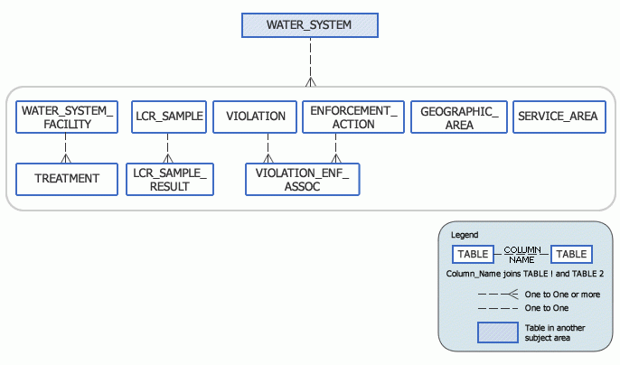

# EPA SDWIS

## Data Model

## Data Dictionary
* [PRIMACY_AGENCY](https://github.com/geominr/BlueConduit/blob/master/SDWIS/README.md#primacy_agency)
* [OWNER_TYPE](https://github.com/geominr/BlueConduit/blob/master/SDWIS/README.md#owner_type)
* [RULE_CODE](https://github.com/geominr/BlueConduit/blob/master/SDWIS/README.md#rule_code)
* [VIOLATION_CODE](https://github.com/geominr/BlueConduit/blob/master/SDWIS/README.md#violation_code)
* [CONTAMINANT_CODE](https://github.com/geominr/BlueConduit/blob/master/SDWIS/README.md#contaminant_code)
* [VIOLATION_CODE_1](https://github.com/geominr/BlueConduit/blob/master/SDWIS/README.md#violation_code_1)
* [RULE_CODE_1](https://github.com/geominr/BlueConduit/blob/master/SDWIS/README.md#rule_code_1)
* [CONTAMINANT_CODE_1](https://github.com/geominr/BlueConduit/blob/master/SDWIS/README.md#contaminant_code_1)
* [CONTAMINANT_CODE_2](https://github.com/geominr/BlueConduit/blob/master/SDWIS/README.md#contaminant_code_2)
* [RULE_CODE_2](https://github.com/geominr/BlueConduit/blob/master/SDWIS/README.md#rule_code_2)
* [VIOLATION_CODE_2](https://github.com/geominr/BlueConduit/blob/master/SDWIS/README.md#violation_code_2)
* [VIO_NPM](https://github.com/geominr/BlueConduit/blob/master/SDWIS/README.md#vio_npm)
* [IS_HEALTH_BASED](https://github.com/geominr/BlueConduit/blob/master/SDWIS/README.md#is_health_based)
* [RULE_FAMILY](https://github.com/geominr/BlueConduit/blob/master/SDWIS/README.md#rule_family)
* [RULE_GROUP](https://github.com/geominr/BlueConduit/blob/master/SDWIS/README.md#rule_group)
* [VIOLATION_CATEGORY_CODE](https://github.com/geominr/BlueConduit/blob/master/SDWIS/README.md#violation_category_code)
* [COMPLIANCE_STATUS_CODE](https://github.com/geominr/BlueConduit/blob/master/SDWIS/README.md#compliance_status_code)
* [PUBLIC_NOTIFICATION_TIER](https://github.com/geominr/BlueConduit/blob/master/SDWIS/README.md#public_notification_tier)
* [IS_MAJOR_VIOL_IND](https://github.com/geominr/BlueConduit/blob/master/SDWIS/README.md#is_major_viol_ind)
* [UNIT_OF_MEASURE](https://github.com/geominr/BlueConduit/blob/master/SDWIS/README.md#unit_of_measure)
* [ORIGINATOR_CODE](https://github.com/geominr/BlueConduit/blob/master/SDWIS/README.md#originator_code)
* [ENF_ACTION_TYPE](https://github.com/geominr/BlueConduit/blob/master/SDWIS/README.md#enf_action_type)
* [PWS_TYPE](https://github.com/geominr/BlueConduit/blob/master/SDWIS/README.md#pws_type)
* [PRIMACY_TYPE](https://github.com/geominr/BlueConduit/blob/master/SDWIS/README.md#primacy_type)
* [GWSW](https://github.com/geominr/BlueConduit/blob/master/SDWIS/README.md#gwsw)
* [PRIMARY_SOURCE](https://github.com/geominr/BlueConduit/blob/master/SDWIS/README.md#primary_source)
* [ACTIVITY_STATUS](https://github.com/geominr/BlueConduit/blob/master/SDWIS/README.md#activity_status)
* [WHOLESALER](https://github.com/geominr/BlueConduit/blob/master/SDWIS/README.md#wholesaler)

## OWNER_TYPE

<b></b>: All Owner Types

<b>F</b>: Federal government

<b>L</b>: Local government

<b>N</b>: Native American

<b>P</b>: Private

<b>M</b>: Public/Private

<b>S</b>: State government

## RULE_CODE

<b>110</b>: Total Coliform Rule

<b>111</b>: Revised Total Coliform Rule

<b>121</b>: Surface Water Treatment Rule

<b>122</b>: Long Term 1 Enhanced Surface Water Treatment Rule

<b>123</b>: Long Term 2 Enhanced Surface Water Treatment Rule

<b>130</b>: Filter Backwash Rule

<b>140</b>: Ground Water Rule

<b>210</b>: Stage 1 Disinfectants and Disinfection Byproducts Rule

<b>220</b>: Stage 2 Disinfectants and Disinfection Byproducts Rule

<b>230</b>: Total Trihalomethanes

<b>310</b>: Volatile Organic Chemicals

<b>320</b>: Synthetic Organic Chemicals

<b>331</b>: Nitrates

<b>332</b>: Arsenic

<b>333</b>: Inorganic Chemicals

<b>340</b>: Radionuclides

<b>350</b>: Lead and Copper Rule

<b>410</b>: Public Notice Rule

<b>420</b>: Consumer Confidence Rule

<b>430</b>: Miscellaneous

<b>500</b>: Not Regulated

## VIOLATION_CODE

<b></b>: All

<b>01</b>: Maximum Contaminant Level Violation, Single Sample

<b>02</b>: Maximum Contaminant Level Violation, Average

<b>03</b>: Monitoring, Regular

<b>04</b>: Monitoring, Check/Repeat/Confirmation

<b>05</b>: Notification, State

<b>06</b>: Notification, Public

<b>07</b>: Treatment Techniques

<b>08</b>: Variance/Exemption/Other Compliance

<b>09</b>: Record Keeping

<b>10</b>: Operations Report

<b>11</b>: Non-Acute MRDL

<b>12</b>: Treatment Technique No Certif. Operator

<b>13</b>: Acute Maximum Residual Disinfectant Level

<b>19</b>: Failure to Conduct Assessment Monitoring

<b>1A</b>: Maximum Contaminant Level Violation, E. coli (RTCR)

<b>20</b>: Failure to Consult with State

<b>21</b>: Maximum Contaminant Level Violation, Acute (TCR)

<b>22</b>: Maximum Contaminant Level Violation, Monthly (TCR)

<b>23</b>: Monitoring, Routine Major (TCR)

<b>24</b>: Monitoring, Routine Minor (TCR)

<b>25</b>: Monitoring, Repeat Major (TCR)

<b>26</b>: Monitoring, Repeat Minor (TCR)

<b>27</b>: Monitoring and Reporting (DBP)

<b>28</b>: Sanitary Survey (TCR)

<b>29</b>: Failure Submit Filter Profile/CPE Report

<b>2A</b>: Treatment Technique, Level 1 Assessment (RTCR)

<b>2B</b>: Treatment Technique, Level 2 Assessment (RTCR)

<b>2C</b>: Treatment Technique, Corrective/Expedited Actions (RTCR)

<b>2D</b>: Treatment Technique Startup Procedures (RTCR)

<b>30</b>: Monitoring, Routine (IDSE)

<b>31</b>: Monitoring of Treatment (SWTR-Unfilt/GWR)

<b>32</b>: Monitoring, Source Water (LT2)

<b>33</b>: Failure Submit Treatment Requirement Rpt

<b>34</b>: Monitoring, Source Water (GWR)

<b>35</b>: Failure Submit IDSE/Subpart V Plan Rpt

<b>36</b>: Monitoring of Treatment (SWTR-Filter)

<b>37</b>: Treatment Tech. No Prior State Approval

<b>38</b>: Monitoring, Turbidity (Enhanced SWTR)

<b>39</b>: Monitoring and Reporting (FBRR)

<b>3A</b>: Monitoring, Routine (RTCR)

<b>3B</b>: Monitoring, Additional Routine (RTCR)

<b>3C</b>: Monitor Coliform Turbidity Trigger (RTCR)

<b>3D</b>: Monitoring, Lab Certification/Method Error (RTCR)

<b>40</b>: Treatment Technique (FBRR)

<b>41</b>: Treatment Technique (SWTR and GWR)

<b>42</b>: Failure to Filter (SWTR)

<b>43</b>: Single Turbidity Exceed (Enhanced SWTR)

<b>44</b>: Monthly Turbidity Exceed (Enhanced SWTR)

<b>45</b>: Failure To Address Deficiency

<b>46</b>: Treatment Technique Precursor Removal

<b>47</b>: Treatment Technique Uncovered Reservoir

<b>48</b>: Failure To Address Contamination

<b>4A</b>: Reporting, Assessment Forms (RTCR)

<b>4B</b>: Report Sample Result/Fail Monitor (RTCR)

<b>4C</b>: Report Startup Procedures Cert Form (RTCR)

<b>4D</b>: Notification, E Coli Positive (RTCR)

<b>4E</b>: Notification, E. coli Maximum Contaminant Level Violation (RTCR

<b>4F</b>: Notify Level  1/Level 2 Treatment Technique Violation, Correct Action (RTCR)

<b>51</b>: Initial Tap Sampling for Pb and Cu

<b>52</b>: Follow-up Or Routine LCR Tap M/R

<b>53</b>: Water Quality Parameter M/R

<b>56</b>: Initial, Follow-up, or Routine Source Water M/R

<b>57</b>: OCCT/SOWT Study/Recommendation

<b>58</b>: OCCT/SOWT Treatment Installation/Demonstration

<b>59</b>: WQP Entry Point/Tap Treatment Technique Non-Compliance

<b>5A</b>: Sample Siting Plan Errors (RTCR)

<b>5B</b>: Recordkeeping Violations (RTCR)

<b>63</b>: MPL Non-Compliance

<b>64</b>: Lead Service Line Replacement (LSLR)

<b>65</b>: Public Education

<b>66</b>: Lead Consumer Notice

<b>71</b>: Consumer Confidence Report Complete Failure to Report

<b>72</b>: Consumer Confidence Report Inadequate Reporting

<b>73</b>: Failure to Notify Other PWS

<b>75</b>: Public Notification Violation for NPDWR Violation

<b>76</b>: Public Notification Violation without NPDWR Violation

## CONTAMINANT_CODE

<b></b>: All

<b>0100</b>: Turbidity

<b>0200</b>: Surface Water Treatment Rule

<b>0300</b>: Interim Enhanced Surfsce Water Treatment Rule

<b>0400</b>: Stage 1 Disinfectants and Disinfection Byproducts Rule

<b>0500</b>: Filter Backwash Rule

<b>0600</b>: Stage 2 Disinfectants and Disinfection Byproducts Rule

<b>0700</b>: Groundwater Rule

<b>0800</b>: Long Term 2 Enhanced Surface Water Treatment Rule

<b>0999</b>: Chlorine

<b>1***</b>: ALL NIPDWR INORGANIC CONTAMINANTS

<b>1000</b>: Total Chlorine

<b>1001</b>: Combined Chlorine

<b>1002</b>: Aluminum

<b>1003</b>: Nitrogen-Ammonia as (N)

<b>1004</b>: Bromide

<b>1005</b>: Arsenic

<b>1006</b>: Chloramine

<b>1007</b>: Chlorate

<b>1008</b>: Chlorine dioxide

<b>1009</b>: Chlorite

<b>1010</b>: Barium

<b>1011</b>: Bromate

<b>1012</b>: Residual Chlorine

<b>1013</b>: Free Residual Chlorine

<b>1014</b>: Ozone Residual

<b>1015</b>: Cadmium

<b>1016</b>: Calcium

<b>1017</b>: Chloride

<b>1018</b>: Carbon, Total

<b>1019</b>: CALCIUM

<b>1020</b>: Chromium

<b>1021</b>: Hydroxide as Calcium Carbonate

<b>1022</b>: COPPER, FREE

<b>1023</b>: UNKNOWN

<b>1024</b>: CYANIDE

<b>1025</b>: Fluoride

<b>1026</b>: Bicarbonate as HCO3

<b>1027</b>: Hydrogen sulfide

<b>1028</b>: Iron

<b>1029</b>: Iron, Suspended

<b>1030</b>: Lead

<b>1031</b>: Magnesium

<b>1032</b>: Manganese

<b>1033</b>: Manganese, Suspended

<b>1034</b>: Manganese, Dissolved

<b>1035</b>: Mercury

<b>1036</b>: Nickel

<b>1037</b>: Total Kjeldahl Nitrogen (in Water mg/l)

<b>1038</b>: Nitrate-Nitrite

<b>1039</b>: Perchlorate

<b>1040</b>: Nitrate

<b>1041</b>: Nitrite

<b>1042</b>: Potassium

<b>1043</b>: Phosphate, Total

<b>1044</b>: Orthophosphate

<b>1045</b>: Selenium

<b>1046</b>: Percent Sodium

<b>1047</b>: Sodium Adsorption Ratio

<b>1048</b>: Total Hardness (Gr/Gal)D

<b>1049</b>: Silica

<b>1050</b>: Silver

<b>1051</b>: Strontium

<b>1052</b>: Sodium

<b>1055</b>: Sulfate

<b>1056</b>: Residue, Non filterable (TSS)

<b>1057</b>: Residue, Total, Filterable

<b>1058</b>: Residue, Filterable-Volatile

<b>1059</b>: Residue, Filterable-Fixed

<b>1060</b>: Residue, Total-Volatile

<b>1061</b>: Residue, Total-Fixed

<b>1062</b>: Tot Extractable Hydrocarbons-Diesel Oil

<b>1063</b>: Residue, Nonfilterable-Fixed

<b>1064</b>: CONDUCTIVITY @ 25 C UMHOS/CM

<b>1065</b>: Tot Extractable Hydrocarbons-Waste Oil

<b>1066</b>: pH, CaCO3 Stability S.U.

<b>1067</b>: Alkalinity, CaCO3 Stability

<b>1068</b>: Acidity, Total (CaCO3)

<b>1069</b>: Acidity, M.O. (CaCO3)

<b>1070</b>: Residue, Total

<b>1071</b>: Residue, Settleable (by Weight)

<b>1072</b>: PHOSPHORUS, SOLUBLE

<b>1073</b>: Phosphate, Reactive

<b>1074</b>: Antimony, Total

<b>1075</b>: Beryllium, Total

<b>1076</b>: COD mg/l

<b>1077</b>: Residue, Nonfilterable, Volatile

<b>1078</b>: Bismuth, Total

<b>1079</b>: Boron, Total

<b>1080</b>: CHROMIUM, HEX

<b>1081</b>: Cobalt, Total

<b>1082</b>: Iron, Dissolved

<b>1083</b>: Lithium, Total

<b>1084</b>: Molybdenum, Total

<b>1085</b>: Thallium, Total

<b>1086</b>: Tin, Total

<b>1087</b>: Titanium, Total

<b>1088</b>: Vanadium, Total

<b>1089</b>: MBAS - FOAMING AGENTS (SURFACTANTS)

<b>1090</b>: Oil-Grease, Total

<b>1091</b>: BOD, 5-DAY, MG/L

<b>1092</b>: TOD mg/l

<b>1093</b>: Phosphorus, Total

<b>1094</b>: Asbestos

<b>1095</b>: Zinc

<b>1096</b>: OZONE

<b>1901</b>: Carbon dioxide

<b>1902</b>: Carbon disulfide

<b>1905</b>: Color

<b>1910</b>: Corrosivity

<b>1914</b>: Calcium Hardness

<b>1915</b>: Hardness, Total (as CaC03)

<b>1916</b>: Hardness, Carbonate

<b>1917</b>: Hardness, Noncarbonate

<b>1918</b>: Hardness, Calcium Magnesium

<b>1919</b>: Calcium

<b>1920</b>: Odor

<b>1925</b>: pH

<b>1927</b>: Alkalinity, Total

<b>1928</b>: Alkalinity, Bicarbonate

<b>1929</b>: Alkalinity, Carbonate

<b>1930</b>: TDS

<b>1931</b>: Alkalinity, Phenolphthalein

<b>1993</b>: Stability Index

<b>1994</b>: Aggressive Index

<b>1995</b>: Scale Forming

<b>1996</b>: Temperature (Centigrade)

<b>1997</b>: LANGELIER INDEX (PH(S))

<b>1998</b>: Saturation Index

<b>1999</b>: Note:  (Reserved by MSIS)

<b>2***</b>: ALL NIPDWR ORGANIC CONTAMINANTS

<b>2004</b>: Alachlor ESA

<b>2005</b>: Endrin

<b>2006</b>: DESETHYLATRAZINE

<b>2007</b>: DES-ISOPROPYL-ATRAZINE

<b>2009</b>: 4,4’-DDE

<b>2010</b>: BHC-GAMMA

<b>2015</b>: Methoxychlor

<b>2020</b>: Toxaphene

<b>2021</b>: Carbaryl

<b>2022</b>: Methomyl

<b>2023</b>: BAYGON

<b>2024</b>: Methiocarb

<b>2027</b>: Acetochlor

<b>2028</b>: Paraquat

<b>2029</b>: PROMETON

<b>2030</b>: p-Isopropyltoluene

<b>2031</b>: Dalapon

<b>2032</b>: Diquat

<b>2033</b>: Endothall

<b>2034</b>: Glyphosate

<b>2035</b>: Di(2-ethylhexyl) adipate

<b>2036</b>: OXAMYL

<b>2037</b>: Simazine

<b>2038</b>: PAHs

<b>2039</b>: Di(2-ethylhexyl) phthalate

<b>2040</b>: Picloram

<b>2041</b>: Dinoseb

<b>2042</b>: Hexachlorocyclopentadiene

<b>2043</b>: Aldicarb sulfoxide

<b>2044</b>: Aldicarb sulfone

<b>2045</b>: Metolachlor

<b>2046</b>: Carbofuran

<b>2047</b>: Aldicarb

<b>2048</b>: Hypochlorite Ion

<b>2049</b>: 1,4-Dioxane

<b>2050</b>: Atrazine

<b>2051</b>: LASSO

<b>2052</b>: EPTC

<b>2053</b>: SUTAN

<b>2054</b>: CYANAZINE

<b>2055</b>: Trifluralin

<b>2056</b>: SPECTRACIDE

<b>2057</b>: CHLOROPYRIFOS

<b>2058</b>: Malathion

<b>2059</b>: GUTHION

<b>2060</b>: ISOFENPHOS

<b>2061</b>: Trithion

<b>2062</b>: Ethion

<b>2063</b>: 2,3,7,8-TCDD

<b>2064</b>: PARATHION (ETHYL)

<b>2065</b>: Heptachlor

<b>2066</b>: 3-Hydroxycarbofuran

<b>2067</b>: Heptachlor epoxide

<b>2068</b>: Endosulfan I

<b>2069</b>: PARA-PARA DDE

<b>2070</b>: Dieldrin

<b>2071</b>: PARA-PARA DDD

<b>2072</b>: Endosulfan II

<b>2073</b>: Phosdrin

<b>2074</b>: Endosulfan sulfate

<b>2075</b>: PARA-PARA DDT

<b>2076</b>: Butachlor

<b>2077</b>: Propachlor

<b>2078</b>: Cryptosporidium

<b>2079</b>: Dibromoacetonitrile

<b>2080</b>: Cyanogen chloride

<b>2081</b>: AMYL ACETATE

<b>2082</b>: Butane

<b>2083</b>: Butyl acetate

<b>2084</b>: n-Butyl alcohol

<b>2085</b>: sec-Butyl alcohol

<b>2086</b>: 1-Chlorobutane

<b>2087</b>: 1-Chlorohexane

<b>2088</b>: Ethyl acetate

<b>2089</b>: Ethyl alcohol

<b>2090</b>: Ethyl ether

<b>2091</b>: ISO-OCTANE

<b>2092</b>: Isobutyl acetate

<b>2093</b>: Isobutyl alcohol

<b>2094</b>: Isopropyl acetate

<b>2095</b>: Isopropyl alcohol

<b>2096</b>: RDX

<b>2097</b>: AMINOMETHYLPHOSPHONIC ACID

<b>2098</b>: Bromacil

<b>2099</b>: DCPA

<b>2100</b>: DCPA MONO ACID DEGRADATE

<b>2101</b>: DCPA DI ACID DEGRADATE

<b>2102</b>: Disulfoton

<b>2103</b>: Diuron

<b>2104</b>: Fonofos (Dyfonate)

<b>2105</b>: 2,4-D

<b>2106</b>: 2,4-DB

<b>2107</b>: Triclopyr

<b>2108</b>: DCPA mono/di-acid degradates

<b>2109</b>: 3,4-DICHLOROBENZOIC ACID

<b>2110</b>: 2,4,5-TP

<b>2111</b>: 2,4,5-T

<b>2112</b>: MECOPROP

<b>2113</b>: MCPA

<b>2114</b>: PERMETHRIN (MIXED, CIS, TRANS)

<b>2200</b>: 2-Nitroaniline

<b>2201</b>: 3-Nitroaniline

<b>2202</b>: Dibenzofuran

<b>2203</b>: 4-Nitroaniline

<b>2204</b>: Azobenzene

<b>2205</b>: Chloramben

<b>2206</b>: Dichlorprop

<b>2207</b>: BENFLURALIN

<b>2209</b>: Bromoxynil

<b>2210</b>: Chloromethane

<b>2212</b>: Dichlorodifluoromethane

<b>2213</b>: Chlorothalonil

<b>2214</b>: Bromomethane

<b>2215</b>: CHLOROPYRIFOS

<b>2216</b>: Chloroethane

<b>2217</b>: Chlorsulfuron

<b>2218</b>: Trichlorofluoromethane

<b>2219</b>: Trichloroacetonitrile

<b>2220</b>: DICHROTOPHOS

<b>2221</b>: Dimethoate

<b>2222</b>: BIS(2-CHLOROETHYL) ETHER

<b>2223</b>: DI-N-OCTYL PHTHALATE

<b>2224</b>: trans-1,3-Dichloropropene

<b>2225</b>: Hexachloroethane

<b>2226</b>: trans-1,2-Dichloropropene

<b>2227</b>: 2-Methyl-4,6-dinitrophenol

<b>2228</b>: cis-1,3-Dichloropropene

<b>2229</b>: N-Nitrosodiphenylamine

<b>2230</b>: Aniline

<b>2231</b>: Benzyl alcohol

<b>2232</b>: 1,2-DIBROMOETHYLENE

<b>2233</b>: 2-METHYLPHENOL

<b>2234</b>: 2-CHLOROETHYL VINYL ETHER

<b>2235</b>: 4-Methylphenol

<b>2236</b>: Diiodomethane

<b>2237</b>: Benzoic acid

<b>2238</b>: Acrolein

<b>2239</b>: 4-Chloroaniline

<b>2240</b>: Acrylonitrile

<b>2241</b>: 2-METHYLNAPHTHALENE

<b>2242</b>: 2,4,5-Trichlorophenol

<b>2243</b>: Acetone

<b>2244</b>: Bis(2-chloroisopropyl) ether

<b>2245</b>: Isopropyl ether

<b>2246</b>: Hexachlorobutadiene

<b>2247</b>: Methyl ethyl ketone

<b>2248</b>: Naphthalene

<b>2249</b>: Methyl isobutyl ketone

<b>2250</b>: BIS(2-CHLOROETHOXY)METHANE

<b>2251</b>: METHYL TERT-BUTYL ETHER

<b>2252</b>: ETHALFLURALIN

<b>2253</b>: DEMETON METHYL

<b>2254</b>: Nitrobenzene

<b>2255</b>: Pendimethalin

<b>2256</b>: Propazine

<b>2257</b>: Epichlorohydrin

<b>2258</b>: 2-Chloronaphthalene

<b>2259</b>: 1-NAPHTHOL

<b>2260</b>: Acenaphthylene

<b>2261</b>: Acenaphthene

<b>2262</b>: Isophorone

<b>2263</b>: Tetrahydrofuran

<b>2264</b>: Fluorene

<b>2265</b>: Acrylamide

<b>2266</b>: 2,6-Dinitrotoluene

<b>2267</b>: PROPHOS

<b>2268</b>: 1,2-Diphenylhydrazine

<b>2269</b>: 2-Hexanone

<b>2270</b>: 2,4-Dinitrotoluene

<b>2271</b>: Tebuthiuron

<b>2272</b>: Terbacil

<b>2273</b>: trans-Nonachlor

<b>2274</b>: HEXACHLOROBENZENE

<b>2275</b>: trans-permethrin

<b>2276</b>: 4-Bromophenyl phenyl ether

<b>2277</b>: 4-Methyl-2-pentanone

<b>2278</b>: Phenanthrene

<b>2280</b>: Anthracene

<b>2282</b>: DIMETHYL PHTHALATE

<b>2283</b>: Linuron

<b>2284</b>: DIETHYL PHTHALATE

<b>2286</b>: Fluoranthene

<b>2288</b>: Pyrene

<b>2289</b>: Propanil

<b>2290</b>: DI-N-BUTYL PHTHALATE

<b>2291</b>: Diflubenzuron

<b>2292</b>: Benzidine

<b>2293</b>: Ethyl methacrylate

<b>2294</b>: BUTYLBENZYL PHTHALATE

<b>2295</b>: Methyl methacrylate

<b>2296</b>: Chrysene

<b>2297</b>: Fluometuron

<b>2298</b>: Bis(2-ethylhexyl) phthalate

<b>2300</b>: Benzo(a)anthracene

<b>2301</b>: Siduron

<b>2302</b>: BENZO(B)FLUORANTHENE

<b>2303</b>: Thidiazuron

<b>2304</b>: BENZO(K)FLUORANTHENE

<b>2306</b>: Benzo(a)pyrene

<b>2308</b>: Ideno(1,2,3-cd)pyrene

<b>2310</b>: DIBENZO(A,H)ANTHRACENE

<b>2312</b>: BENZO(G,H,I)PERYLENE

<b>2314</b>: N-Nitrosodimethylamine

<b>2315</b>: 1-METHYL-NAPHTHALENE

<b>2316</b>: N-NITROSODI-N-PROPYLAMINE

<b>2318</b>: 4-Chlorophenyl phenyl ether

<b>2320</b>: 3,3-Dichlorobenzidine

<b>2324</b>: Bis(chloromethyl) ether

<b>2325</b>: Pentane

<b>2326</b>: Pentachlorophenol

<b>2327</b>: Pentachloroethane

<b>2328</b>: 2,4-Dinitrophenol

<b>2330</b>: P-CHLORO-M-CRESOL

<b>2332</b>: 2,4,6-Trichlorophenol

<b>2334</b>: 2,4-Dichlorophenol

<b>2336</b>: 2,4-Dimethylphenol

<b>2340</b>: 2-Nitrophenol

<b>2342</b>: 4-Nitrophenol

<b>2344</b>: 2-Chlorophenol

<b>2346</b>: 4,6-Dinitro-o-cresol

<b>2348</b>: .ALPHA.-BHC

<b>2350</b>: .BETA.-BHC

<b>2354</b>: .DELTA.-BHC

<b>2356</b>: Aldrin

<b>2365</b>: ORTHO-PARA DDE

<b>2367</b>: ORTHO-PARA DDD

<b>2369</b>: ORTHO-PARA DDT

<b>2370</b>: KELTHANE

<b>2371</b>: Tedion

<b>2372</b>: Endrin aldehyde

<b>2374</b>: Kerosene

<b>2376</b>: n-Hexane

<b>2377</b>: 1,3,5-Trichlorobenzene

<b>2378</b>: 1,2,4-Trichlorobenzene

<b>2380</b>: cis-1,2-Dichloroethylene

<b>2383</b>: Total Polychlorinated Biphenyls (PCB)

<b>2384</b>: DECACHLOROBIPHENYL

<b>2388</b>: Aroclor 1016

<b>2390</b>: Aroclor 1221

<b>2392</b>: Aroclor 1232

<b>2394</b>: Aroclor 1242

<b>2396</b>: Aroclor 1248

<b>2398</b>: Aroclor 1254

<b>2399</b>: PCB 1262

<b>2400</b>: Aroclor 1260

<b>2401</b>: Dichlorobenzenes, Total

<b>2402</b>: ALLYL CHLORIDE

<b>2408</b>: Dibromomethane

<b>2410</b>: 1,1-Dichloropropene

<b>2412</b>: 1,3-Dichloropropane

<b>2413</b>: 1,3-DICHLOROPROPENE

<b>2414</b>: 1,2,3-Trichloropropane

<b>2416</b>: 2,2-Dichloropropane

<b>2418</b>: 1,2,4-Trimethylbenzene

<b>2419</b>: 1,2,3-Trimethylbenzene

<b>2420</b>: 1,2,3-Trichlorobenzene

<b>2422</b>: n-Butylbenzene

<b>2424</b>: 1,3,5-Trimethylbenzene

<b>2426</b>: tert-Butylbenzene

<b>2428</b>: sec-Butylbenzene

<b>2430</b>: Bromochloromethane

<b>2440</b>: Dicamba

<b>2441</b>: Methane

<b>2442</b>: Methyl acetate

<b>2443</b>: Methyl alcohol

<b>2444</b>: Methyl Cellosolve

<b>2445</b>: Propyl acetate

<b>2446</b>: n-Propyl alcohol

<b>2447</b>: Vinyl acetate

<b>2449</b>: ETHANOIC ACID

<b>2450</b>: Monochloroacetic acid

<b>2451</b>: Dichloroacetic Acid

<b>2452</b>: Trichloroacetic Acid

<b>2453</b>: Monobromoacetic acid

<b>2454</b>: Dibromoacetic acid

<b>2455</b>: Bromochloroacetic Acid

<b>2456</b>: Total Haloacetic Acids (HAA5)

<b>2458</b>: METHYL IODINE

<b>2460</b>: Chloral hydrate

<b>2461</b>: Dichloroacetonitrile

<b>2462</b>: Bromochloroacetonitrile

<b>2463</b>: 1,1-Dichloropropanone

<b>2464</b>: 1,1,1-Trichloropropanone

<b>2465</b>: Chloropicrin

<b>2466</b>: Chloroacetonitrile

<b>2467</b>: METHACRYLONITRILE

<b>2468</b>: Propionitrile

<b>2469</b>: 2-Nitropropane

<b>2470</b>: ACETALDEHYDE

<b>2471</b>: Propanal

<b>2472</b>: Butanal

<b>2473</b>: Pentanal

<b>2474</b>: Glyoxal

<b>2475</b>: Methyl gloyoxal

<b>2476</b>: Hexanal

<b>2477</b>: Heptanal

<b>2478</b>: Octanal

<b>2479</b>: Benzaldehyde

<b>2480</b>: Nonanal

<b>2481</b>: Decanal

<b>2485</b>: AOC/BDOC

<b>2520</b>: Vinyl 2-chloroethyl ether

<b>2545</b>: TERBUFOS

<b>2570</b>: FONOFOS

<b>2590</b>: MOCAP

<b>2595</b>: Metribuzin

<b>2605</b>: THIMET

<b>2615</b>: Prowl

<b>2620</b>: Amiben

<b>2625</b>: BENTAZON

<b>2626</b>: MOLINATE

<b>2635</b>: BOLSTAR

<b>2650</b>: DICHLOROETHYLENE, TOTAL

<b>2655</b>: 1,3-Dichloropropylene, Total

<b>2727</b>: THIOBENCARB (BOLERO)

<b>2904</b>: TRICHLOROTRIFLUOROETHANE

<b>2905</b>: Foaming Agents (Surfactants)

<b>2910</b>: Phenols

<b>2919</b>: Carbon, Dissolved Organic (DOC)

<b>2920</b>: CARBON, TOTAL

<b>2921</b>: Total Organic Halide (TOX)

<b>2922</b>: UV Absorbance @254 nm

<b>2923</b>: SUVA (SPECFIC ULTRAVIOLET ABSORBANCE)

<b>2930</b>: Kepone

<b>2931</b>: 1,2-DIBROMO-3-CHLOROPROPANE

<b>2932</b>: Mirex

<b>2933</b>: DICHLORAN

<b>2934</b>: PENTACHLORONITROBENZENE

<b>2940</b>: HMPA

<b>2941</b>: Chloroform

<b>2942</b>: Bromoform

<b>2943</b>: Bromodichloromethane

<b>2944</b>: Dibromochloromethane

<b>2946</b>: ETHYLENE DIBROMIDE

<b>2949</b>: Maximum Total Trihalomethane Potential

<b>2950</b>: TTHM

<b>2951</b>: SIMULATED DISTRIBUTION SYSTEM (SDS) TEST

<b>2952</b>: CHLORAL HYDRATE

<b>2953</b>: CHLOROPICRIN

<b>2954</b>: DICHLOROACETONITRILE

<b>2955</b>: Xylenes, Total

<b>2956</b>: 1,1,1-TRICHLORO-2-PROPANONE

<b>2957</b>: 1,1-DICHLORO-2-PROPANONE

<b>2959</b>: Chlordane

<b>2960</b>: Ethylene glycol

<b>2961</b>: Formaldehyde

<b>2962</b>: p-Xylene

<b>2963</b>: XYLENE, META AND PARA

<b>2964</b>: DICHLOROMETHANE

<b>2965</b>: o-Chlorotoluene

<b>2966</b>: p-Chlorotoluene

<b>2967</b>: m-Dichlorobenzene

<b>2968</b>: o-Dichlorobenzene

<b>2969</b>: p-Dichlorobenzene

<b>2970</b>: trans-1,4-Dichloro-2-butene

<b>2975</b>: Dichloroiodomethane

<b>2976</b>: Vinyl chloride

<b>2977</b>: 1,1-Dichloroethylene

<b>2978</b>: 1,1-Dichloroethane

<b>2979</b>: trans-1,2-Dichloroethylene

<b>2980</b>: 1,2-Dichloroethane

<b>2981</b>: 1,1,1-Trichloroethane

<b>2982</b>: Carbon tetrachloride

<b>2983</b>: 1,2-Dichloropropane

<b>2984</b>: Trichloroethylene

<b>2985</b>: 1,1,2-Trichloroethane

<b>2986</b>: 1,1,1,2-Tetrachloroethane

<b>2987</b>: Tetrachloroethylene

<b>2988</b>: 1,1,2,2-Tetrachloroethane

<b>2989</b>: CHLOROBENZENE

<b>2990</b>: Benzene

<b>2991</b>: Toluene

<b>2992</b>: Ethylbenzene

<b>2993</b>: Bromobenzene

<b>2994</b>: Isopropylbenzene

<b>2995</b>: m-Xylene

<b>2996</b>: Styrene

<b>2997</b>: o-Xylene

<b>2998</b>: n-Propylbenzene

<b>2999</b>: Note:  (Reserved by MSIS)

<b>2A01</b>: Gasoline

<b>2A02</b>: #2 FUEL OIL

<b>2A03</b>: Jet Fuel

<b>2A04</b>: #4 FUEL OIL

<b>2A05</b>: #5 FUEL OIL

<b>2A06</b>: Motor Oil

<b>2A07</b>: Submersible Pump Oil

<b>2A08</b>: VARSOL

<b>2A09</b>: Propane

<b>2U15</b>: 15 Unregulated Phase I VOCs

<b>2U34</b>: 34 Unregulated Phase I VOCs

<b>2U36</b>: 36 Unregulated Phase I VOCs

<b>2V07</b>: 7 Regulated Phase I VOCs

<b>2V08</b>: 8 Regulated Phase I VOCs

<b>3000</b>: Coliform (Pre-TCR)

<b>3001</b>: Heterotrophic Bacteria (HPC or SPC)

<b>3002</b>: ENTEROCOCCI

<b>3003</b>: Fecal Streptococcus

<b>3004</b>: Staphylococcus

<b>3005</b>: Non-coliform Growth Identification

<b>3006</b>: Iron Bacteria Id

<b>3007</b>: Salmonella-Shigella

<b>3008</b>: Giardia lamblia

<b>3009</b>: Fungus /ml

<b>3010</b>: Virus PFU/gal

<b>3011</b>: Actinomycetes /ml

<b>3012</b>: Legionella

<b>3013</b>: Fecal Coliform

<b>3014</b>: E. COLI

<b>3015</b>: Cryptosporidium

<b>3016</b>: SHIGELLA

<b>3017</b>: PSEUDOMONAS

<b>3018</b>: CLOSTRIDIUM

<b>3019</b>: CAMPYLOBACTER JEJUNI

<b>3020</b>: VIBRIO CHOLERAE

<b>3021</b>: LEPTOSPIRES

<b>3022</b>: YERSINIA ENTEROCOLITICA

<b>3023</b>: ENTEROBACTER

<b>3024</b>: KLEBSIELLA

<b>3025</b>: CITROBACTER

<b>3026</b>: AEROMONAS

<b>3027</b>: ERWINIA

<b>3028</b>: COLIPHAGE

<b>3100</b>: Coliform (TCR)

<b>3200</b>: Aeromonas hydrophila

<b>3201</b>: Aeromonas spp.

<b>3210</b>: Helicobacter pylori

<b>3300</b>: CYANOBACTERIA

<b>3310</b>: ALGAE TOXINS

<b>3400</b>: Echoviruses

<b>3410</b>: Coxsackieviruses

<b>3420</b>: CALICIVIRUSES

<b>3430</b>: Adenoviruses

<b>3500</b>: Microsporidia

<b>4000</b>: Gross Alpha, Excl. Radon and U

<b>4002</b>: Gross Alpha, Incl. Radon and U

<b>4004</b>: Radon

<b>4006</b>: Combined Uranium

<b>4007</b>: Uranium-234

<b>4008</b>: Uranium-235

<b>4009</b>: Uranium-238

<b>4010</b>: Combined Radium (-226 and -228)

<b>4012</b>: Photon Emitters

<b>4020</b>: Radium-226

<b>4030</b>: Radium-228

<b>4040</b>: Alpha, Dissolved

<b>4041</b>: Alpha, Suspended

<b>4042</b>: Beta, Dissolved

<b>4043</b>: Beta, Suspended

<b>4044</b>: Potassium-40, Total

<b>4100</b>: Gross Beta Particle Activity

<b>4101</b>: ManMade Beta Particle and Photon Emitter

<b>4102</b>: Tritium

<b>4104</b>: 4-BERYLLIUM-7

<b>4106</b>: 4-BERYLLIUM-10

<b>4108</b>: 6-CARBON-14

<b>4109</b>: Gross Alpha Particle Activity

<b>4110</b>: 11-SODIUM-22

<b>4112</b>: 15-PHOSPHORUS-32

<b>4114</b>: 16-SULFUR-35

<b>4116</b>: 17-CHLORINE-36

<b>4118</b>: 20-CALCIUM-45

<b>4120</b>: 20-CALCIUM-47

<b>4122</b>: 21-SCANDIUM-46

<b>4124</b>: 21-SCANDIUM-47

<b>4126</b>: 21-SCANDIUM-48

<b>4128</b>: 23-VANADIUM-48

<b>4130</b>: 24-CHROMIUM-51

<b>4132</b>: 25-MANGANESE-54

<b>4134</b>: 26-IRON-55

<b>4136</b>: 26-IRON-59

<b>4138</b>: 27-COBALT-57

<b>4140</b>: 27-COBALT-58

<b>4142</b>: 27-COBALT-60

<b>4144</b>: 28-NICKEL-59

<b>4146</b>: 28-NICKEL-63

<b>4148</b>: 30-ZINC-65

<b>4150</b>: 32-GERANIUM-71

<b>4152</b>: 33-ARSENIC-73

<b>4154</b>: 33-ARSENIC-74

<b>4156</b>: 33-ARSENIC-76

<b>4158</b>: 33-ARSENIC-77

<b>4160</b>: 34-SELENIUM-75

<b>4162</b>: 34-SELENIUM-79

<b>4164</b>: 35-BROMIDE-82

<b>4166</b>: 37-RUBIDIUM-86

<b>4168</b>: 37-RUBIDIUM-87

<b>4170</b>: 38-STRONTIUM-85

<b>4172</b>: 38-STRONTIUM-89

<b>4174</b>: 38-STRONTIUM-90

<b>4176</b>: 39-YTTRIUM-90

<b>4178</b>: 39-YTTRIUM-91

<b>4180</b>: 39-YTTRIUM-91M

<b>4182</b>: 40-ZIRCONIUM-93

<b>4184</b>: 40-ZIRCONIUM-95

<b>4186</b>: 41-NIOBIUM-93

<b>4188</b>: 41-NIOBIUM-95

<b>4190</b>: 42-MOLYBDENUM-93

<b>4192</b>: 42-MOLYBDENUM-99

<b>4194</b>: 43-TECHNETIUM-96

<b>4196</b>: 43-TECHNETIUM-97M

<b>4198</b>: 43-TECHNETIUM-97

<b>4200</b>: 43-TECHNETIUM-99

<b>4202</b>: 43-TECHNETIUM-99M

<b>4204</b>: 44-RUTHENIUM-97

<b>4206</b>: 44-RUTHENIUM-103

<b>4208</b>: 44-RUTHENIUM-106

<b>4210</b>: 45-RHODIUM-105

<b>4212</b>: 46-PALLADIUM-103

<b>4214</b>: 46-PALLADIUM-107

<b>4216</b>: 47-SILVER-105M

<b>4218</b>: 47-SILVER-110M

<b>4220</b>: 47-SILVER-110

<b>4222</b>: 47-SILVER-111

<b>4224</b>: 48-CADMIUM-109

<b>4226</b>: 48-CADMIUM-113M

<b>4228</b>: 48-Cadmium-115M

<b>4230</b>: 48-CADMIUM-115

<b>4232</b>: 49-INDIUM-115

<b>4234</b>: 50-TIN-113

<b>4236</b>: 50-TIN-123

<b>4238</b>: 50-TIN-125

<b>4240</b>: 51-ANTIMONY-122

<b>4242</b>: 51-ANTIMONY-124

<b>4244</b>: 51-ANTIMONY-125

<b>4246</b>: 51-ANTIMONY-127

<b>4248</b>: 52-TELLURIUM-125M

<b>4250</b>: 52-Tellurium-127M

<b>4252</b>: 52-TELLURIUM-127

<b>4254</b>: 52-Tellurium-129M

<b>4256</b>: 52-TELLURIUM-129

<b>4258</b>: 52-TELLURIUM-132

<b>4260</b>: 53-IODINE-126

<b>4262</b>: 53-IODINE-129

<b>4264</b>: 53-IODINE-131

<b>4266</b>: 55-CESIUM-131

<b>4270</b>: 55-CESIUM-134

<b>4272</b>: 55-CESIUM-135

<b>4274</b>: 55-CESIUM-136

<b>4276</b>: 55-CESIUM-137

<b>4278</b>: 56-BARIUM-140

<b>4280</b>: 57-LANTHANUM-140

<b>4282</b>: 58-CERIUM-141

<b>4284</b>: 58-CERIUM-143

<b>4286</b>: 58-CERIUM-144

<b>4288</b>: 59-PRASEODYMIUM-143

<b>4290</b>: 60-NEODYMIUM-147

<b>4292</b>: 61-PROMETHIUM-147

<b>4294</b>: 61-PROMETHIUM-148

<b>4296</b>: 61-Promethium-148M

<b>4298</b>: 61-PROMETHIUM-149

<b>4300</b>: 62-SAMARIUM-151

<b>4302</b>: 62-SAMARIUM-153

<b>4304</b>: 63-EUROPIUM-152

<b>4306</b>: 63-EUROPIUM-154

<b>4308</b>: 63-EUROPIUM-155

<b>4310</b>: 63-EUROPIUM-156

<b>4312</b>: 64-GADOLIUM-153

<b>4314</b>: 65-TERBIUM-160

<b>4316</b>: 66-DYSPROSIUM-166

<b>4318</b>: 67-HOLMIUM-166

<b>4320</b>: 67-Holmium-166M

<b>4322</b>: 68-ERBIUM-169

<b>4324</b>: 69-THULIUM-170

<b>4326</b>: 69-THULIUM-171

<b>4328</b>: 70-YTTERBIUM-175

<b>4330</b>: 71-LUTETIUM-177

<b>4332</b>: 72-HAFNIUM-181

<b>4334</b>: 73-TANTALUM-182

<b>4336</b>: 74-TUNGSTEN-181

<b>4338</b>: 74-TUNGSTEN-185

<b>4340</b>: 74-TUNGSTEN-187

<b>4342</b>: 75-RHENIUM-183

<b>4344</b>: 75-RHENIUM-186

<b>4346</b>: 75-RHENIUM-187

<b>4348</b>: 76-OSMIUM-185

<b>4350</b>: 76-OSMIUM-191

<b>4352</b>: 76-OSMIUM-193

<b>4354</b>: 77-IRIDIUM-190

<b>4356</b>: 77-IRIDIUM-192

<b>4358</b>: 78-PLATINUM-191

<b>4360</b>: 78-Platinum-193

<b>4362</b>: 78-Platinum-193M

<b>4364</b>: 79-GOLD-196

<b>4366</b>: 79-GOLD-198

<b>4368</b>: 81-THALLIUM-204

<b>4370</b>: 82-LEAD-203

<b>4372</b>: 82-LEAD-210

<b>4374</b>: 83-BISMUTH-206

<b>4376</b>: 83-BISMUTH-207

<b>4378</b>: 83-BISMUTH-210

<b>4380</b>: 84-POLONIUM-210

<b>4382</b>: 91-PROTACTINIUM-233

<b>4550</b>: CYCLOATE

<b>4999</b>: Note:  (Reserved by MSIS)

<b>5000</b>: Lead and Copper Rule

<b>6440</b>: NAPROPAMIDE

<b>6650</b>: PRONAMIDE

<b>7000</b>: Consumer Confidence Rule

<b>7035</b>: AMETRYN

<b>7060</b>: ATRATON

<b>7230</b>: CARBOXIN

<b>7240</b>: ALPHA-CHLORDANE

<b>7245</b>: GAMMA-CHLORDANE

<b>7260</b>: CHLOROBENZILATE

<b>7265</b>: CHLORONEB

<b>7275</b>: CHLOROPROPHAM

<b>7500</b>: Public Notice

<b>7570</b>: ETHOPROPHOS

<b>7575</b>: ETRIDIAZOLE

<b>7585</b>: FERNAMIPHOS

<b>7590</b>: FENARIMOL

<b>7635</b>: FLURIDONE

<b>7705</b>: HEXAZINONE

<b>7785</b>: MERPHOS

<b>7820</b>: METHYL PARAXON

<b>7850</b>: MEVINPHOS

<b>7930</b>: NORFLURAZON

<b>8000</b>: Revised Total Coliform Rule

<b>8040</b>: PROMETRYN

<b>8130</b>: SIMETRYN

<b>8140</b>: STIROFOS

<b>8195</b>: TERBUTRYN

<b>8255</b>: TRIADIMEFON

<b>8285</b>: TRICYCLAZOLE

<b>8320</b>: VERNOLATE

<b>8610</b>: DICHLOROVOS

<b>8915</b>: 2-CHLOROBIPHENYL

<b>8920</b>: 2,3-DICHLOROBIPHENYL

<b>8940</b>: 2,4,5-TRICHLOROBIPHENYL

<b>8947</b>: 2,2,4,4-TETRACHLOROBIPHENYL

<b>8977</b>: 2,2,3,4,6-PENTACHLOROBIPHENYL

<b>9042</b>: 2,2,4,4,5,6-HEXACHLOROBIPHENYL

<b>9067</b>: 2,2,3,3,4,4,6-HEPTACHLOROBIPHENYL

<b>9092</b>: 2,2,3,3,4,5,6,6-OCTACHLORPBIPHENYL

<b>9339</b>: CHLORODIBROMOACETIC ACID

<b>9535</b>: BROMODICHLOROACETIC ACID

<b>9537</b>: PEBULATE

<b>9639</b>: TRIBROMOACETIC ACID

<b>9999</b>: BENEZENE 2

<b>CU90</b>: COPPER SUMMARY

<b>NULL</b>: Not applicable

<b>PB90</b>: LEAD SUMMARY

## VIOLATION_CODE_1

<b></b>: All

<b>01</b>: Maximum Contaminant Level Violation, Single Sample

<b>02</b>: Maximum Contaminant Level Violation, Average

<b>03</b>: Monitoring, Regular

<b>04</b>: Monitoring, Check/Repeat/Confirmation

<b>05</b>: Notification, State

<b>06</b>: Notification, Public

<b>07</b>: Treatment Techniques

<b>08</b>: Variance/Exemption/Other Compliance

<b>09</b>: Record Keeping

<b>10</b>: Operations Report

<b>11</b>: Non-Acute MRDL

<b>12</b>: Treatment Technique No Certif. Operator

<b>13</b>: Acute Maximum Residual Disinfectant Level

<b>19</b>: Failure to Conduct Assessment Monitoring

<b>1A</b>: Maximum Contaminant Level Violation, E. coli (RTCR)

<b>20</b>: Failure to Consult with State

<b>21</b>: Maximum Contaminant Level Violation, Acute (TCR)

<b>22</b>: Maximum Contaminant Level Violation, Monthly (TCR)

<b>23</b>: Monitoring, Routine Major (TCR)

<b>24</b>: Monitoring, Routine Minor (TCR)

<b>25</b>: Monitoring, Repeat Major (TCR)

<b>26</b>: Monitoring, Repeat Minor (TCR)

<b>27</b>: Monitoring and Reporting (DBP)

<b>28</b>: Sanitary Survey (TCR)

<b>29</b>: Failure Submit Filter Profile/CPE Report

<b>2A</b>: Treatment Technique, Level 1 Assessment (RTCR)

<b>2B</b>: Treatment Technique, Level 2 Assessment (RTCR)

<b>2C</b>: Treatment Technique, Corrective/Expedited Actions (RTCR)

<b>2D</b>: Treatment Technique Startup Procedures (RTCR)

<b>30</b>: Monitoring, Routine (IDSE)

<b>31</b>: Monitoring of Treatment (SWTR-Unfilt/GWR)

<b>32</b>: Monitoring, Source Water (LT2)

<b>33</b>: Failure Submit Treatment Requirement Rpt

<b>34</b>: Monitoring, Source Water (GWR)

<b>35</b>: Failure Submit IDSE/Subpart V Plan Rpt

<b>36</b>: Monitoring of Treatment (SWTR-Filter)

<b>37</b>: Treatment Tech. No Prior State Approval

<b>38</b>: Monitoring, Turbidity (Enhanced SWTR)

<b>39</b>: Monitoring and Reporting (FBRR)

<b>3A</b>: Monitoring, Routine (RTCR)

<b>3B</b>: Monitoring, Additional Routine (RTCR)

<b>3C</b>: Monitor Coliform Turbidity Trigger (RTCR)

<b>3D</b>: Monitoring, Lab Certification/Method Error (RTCR)

<b>40</b>: Treatment Technique (FBRR)

<b>41</b>: Treatment Technique (SWTR and GWR)

<b>42</b>: Failure to Filter (SWTR)

<b>43</b>: Single Turbidity Exceed (Enhanced SWTR)

<b>44</b>: Monthly Turbidity Exceed (Enhanced SWTR)

<b>45</b>: Failure To Address Deficiency

<b>46</b>: Treatment Technique Precursor Removal

<b>47</b>: Treatment Technique Uncovered Reservoir

<b>48</b>: Failure To Address Contamination

<b>4A</b>: Reporting, Assessment Forms (RTCR)

<b>4B</b>: Report Sample Result/Fail Monitor (RTCR)

<b>4C</b>: Report Startup Procedures Cert Form (RTCR)

<b>4D</b>: Notification, E Coli Positive (RTCR)

<b>4E</b>: Notification, E. coli Maximum Contaminant Level Violation (RTCR

<b>4F</b>: Notify Level  1/Level 2 Treatment Technique Violation, Correct Action (RTCR)

<b>51</b>: Initial Tap Sampling for Pb and Cu

<b>52</b>: Follow-up Or Routine LCR Tap M/R

<b>53</b>: Water Quality Parameter M/R

<b>56</b>: Initial, Follow-up, or Routine Source Water M/R

<b>57</b>: OCCT/SOWT Study/Recommendation

<b>58</b>: OCCT/SOWT Treatment Installation/Demonstration

<b>59</b>: WQP Entry Point/Tap Treatment Technique Non-Compliance

<b>5A</b>: Sample Siting Plan Errors (RTCR)

<b>5B</b>: Recordkeeping Violations (RTCR)

<b>63</b>: MPL Non-Compliance

<b>64</b>: Lead Service Line Replacement (LSLR)

<b>65</b>: Public Education

<b>66</b>: Lead Consumer Notice

<b>71</b>: Consumer Confidence Report Complete Failure to Report

<b>72</b>: Consumer Confidence Report Inadequate Reporting

<b>73</b>: Failure to Notify Other PWS

<b>75</b>: Public Notification Violation for NPDWR Violation

<b>76</b>: Public Notification Violation without NPDWR Violation

## RULE_CODE_1

<b>110</b>: Total Coliform Rule

<b>111</b>: Revised Total Coliform Rule

<b>121</b>: Surface Water Treatment Rule

<b>122</b>: Long Term 1 Enhanced Surface Water Treatment Rule

<b>123</b>: Long Term 2 Enhanced Surface Water Treatment Rule

<b>130</b>: Filter Backwash Rule

<b>140</b>: Ground Water Rule

<b>210</b>: Stage 1 Disinfectants and Disinfection Byproducts Rule

<b>220</b>: Stage 2 Disinfectants and Disinfection Byproducts Rule

<b>230</b>: Total Trihalomethanes

<b>310</b>: Volatile Organic Chemicals

<b>320</b>: Synthetic Organic Chemicals

<b>331</b>: Nitrates

<b>332</b>: Arsenic

<b>333</b>: Inorganic Chemicals

<b>340</b>: Radionuclides

<b>350</b>: Lead and Copper Rule

<b>410</b>: Public Notice Rule

<b>420</b>: Consumer Confidence Rule

<b>430</b>: Miscellaneous

<b>500</b>: Not Regulated

## CONTAMINANT_CODE_1

<b></b>: All

<b>0100</b>: Turbidity

<b>0200</b>: Surface Water Treatment Rule

<b>0300</b>: Interim Enhanced Surfsce Water Treatment Rule

<b>0400</b>: Stage 1 Disinfectants and Disinfection Byproducts Rule

<b>0500</b>: Filter Backwash Rule

<b>0600</b>: Stage 2 Disinfectants and Disinfection Byproducts Rule

<b>0700</b>: Groundwater Rule

<b>0800</b>: Long Term 2 Enhanced Surface Water Treatment Rule

<b>0999</b>: Chlorine

<b>1***</b>: ALL NIPDWR INORGANIC CONTAMINANTS

<b>1000</b>: Total Chlorine

<b>1001</b>: Combined Chlorine

<b>1002</b>: Aluminum

<b>1003</b>: Nitrogen-Ammonia as (N)

<b>1004</b>: Bromide

<b>1005</b>: Arsenic

<b>1006</b>: Chloramine

<b>1007</b>: Chlorate

<b>1008</b>: Chlorine dioxide

<b>1009</b>: Chlorite

<b>1010</b>: Barium

<b>1011</b>: Bromate

<b>1012</b>: Residual Chlorine

<b>1013</b>: Free Residual Chlorine

<b>1014</b>: Ozone Residual

<b>1015</b>: Cadmium

<b>1016</b>: Calcium

<b>1017</b>: Chloride

<b>1018</b>: Carbon, Total

<b>1019</b>: CALCIUM

<b>1020</b>: Chromium

<b>1021</b>: Hydroxide as Calcium Carbonate

<b>1022</b>: COPPER, FREE

<b>1023</b>: UNKNOWN

<b>1024</b>: CYANIDE

<b>1025</b>: Fluoride

<b>1026</b>: Bicarbonate as HCO3

<b>1027</b>: Hydrogen sulfide

<b>1028</b>: Iron

<b>1029</b>: Iron, Suspended

<b>1030</b>: Lead

<b>1031</b>: Magnesium

<b>1032</b>: Manganese

<b>1033</b>: Manganese, Suspended

<b>1034</b>: Manganese, Dissolved

<b>1035</b>: Mercury

<b>1036</b>: Nickel

<b>1037</b>: Total Kjeldahl Nitrogen (in Water mg/l)

<b>1038</b>: Nitrate-Nitrite

<b>1039</b>: Perchlorate

<b>1040</b>: Nitrate

<b>1041</b>: Nitrite

<b>1042</b>: Potassium

<b>1043</b>: Phosphate, Total

<b>1044</b>: Orthophosphate

<b>1045</b>: Selenium

<b>1046</b>: Percent Sodium

<b>1047</b>: Sodium Adsorption Ratio

<b>1048</b>: Total Hardness (Gr/Gal)D

<b>1049</b>: Silica

<b>1050</b>: Silver

<b>1051</b>: Strontium

<b>1052</b>: Sodium

<b>1055</b>: Sulfate

<b>1056</b>: Residue, Non filterable (TSS)

<b>1057</b>: Residue, Total, Filterable

<b>1058</b>: Residue, Filterable-Volatile

<b>1059</b>: Residue, Filterable-Fixed

<b>1060</b>: Residue, Total-Volatile

<b>1061</b>: Residue, Total-Fixed

<b>1062</b>: Tot Extractable Hydrocarbons-Diesel Oil

<b>1063</b>: Residue, Nonfilterable-Fixed

<b>1064</b>: CONDUCTIVITY @ 25 C UMHOS/CM

<b>1065</b>: Tot Extractable Hydrocarbons-Waste Oil

<b>1066</b>: pH, CaCO3 Stability S.U.

<b>1067</b>: Alkalinity, CaCO3 Stability

<b>1068</b>: Acidity, Total (CaCO3)

<b>1069</b>: Acidity, M.O. (CaCO3)

<b>1070</b>: Residue, Total

<b>1071</b>: Residue, Settleable (by Weight)

<b>1072</b>: PHOSPHORUS, SOLUBLE

<b>1073</b>: Phosphate, Reactive

<b>1074</b>: Antimony, Total

<b>1075</b>: Beryllium, Total

<b>1076</b>: COD mg/l

<b>1077</b>: Residue, Nonfilterable, Volatile

<b>1078</b>: Bismuth, Total

<b>1079</b>: Boron, Total

<b>1080</b>: CHROMIUM, HEX

<b>1081</b>: Cobalt, Total

<b>1082</b>: Iron, Dissolved

<b>1083</b>: Lithium, Total

<b>1084</b>: Molybdenum, Total

<b>1085</b>: Thallium, Total

<b>1086</b>: Tin, Total

<b>1087</b>: Titanium, Total

<b>1088</b>: Vanadium, Total

<b>1089</b>: MBAS - FOAMING AGENTS (SURFACTANTS)

<b>1090</b>: Oil-Grease, Total

<b>1091</b>: BOD, 5-DAY, MG/L

<b>1092</b>: TOD mg/l

<b>1093</b>: Phosphorus, Total

<b>1094</b>: Asbestos

<b>1095</b>: Zinc

<b>1096</b>: OZONE

<b>1901</b>: Carbon dioxide

<b>1902</b>: Carbon disulfide

<b>1905</b>: Color

<b>1910</b>: Corrosivity

<b>1914</b>: Calcium Hardness

<b>1915</b>: Hardness, Total (as CaC03)

<b>1916</b>: Hardness, Carbonate

<b>1917</b>: Hardness, Noncarbonate

<b>1918</b>: Hardness, Calcium Magnesium

<b>1919</b>: Calcium

<b>1920</b>: Odor

<b>1925</b>: pH

<b>1927</b>: Alkalinity, Total

<b>1928</b>: Alkalinity, Bicarbonate

<b>1929</b>: Alkalinity, Carbonate

<b>1930</b>: TDS

<b>1931</b>: Alkalinity, Phenolphthalein

<b>1993</b>: Stability Index

<b>1994</b>: Aggressive Index

<b>1995</b>: Scale Forming

<b>1996</b>: Temperature (Centigrade)

<b>1997</b>: LANGELIER INDEX (PH(S))

<b>1998</b>: Saturation Index

<b>1999</b>: Note:  (Reserved by MSIS)

<b>2***</b>: ALL NIPDWR ORGANIC CONTAMINANTS

<b>2004</b>: Alachlor ESA

<b>2005</b>: Endrin

<b>2006</b>: DESETHYLATRAZINE

<b>2007</b>: DES-ISOPROPYL-ATRAZINE

<b>2009</b>: 4,4’-DDE

<b>2010</b>: BHC-GAMMA

<b>2015</b>: Methoxychlor

<b>2020</b>: Toxaphene

<b>2021</b>: Carbaryl

<b>2022</b>: Methomyl

<b>2023</b>: BAYGON

<b>2024</b>: Methiocarb

<b>2027</b>: Acetochlor

<b>2028</b>: Paraquat

<b>2029</b>: PROMETON

<b>2030</b>: p-Isopropyltoluene

<b>2031</b>: Dalapon

<b>2032</b>: Diquat

<b>2033</b>: Endothall

<b>2034</b>: Glyphosate

<b>2035</b>: Di(2-ethylhexyl) adipate

<b>2036</b>: OXAMYL

<b>2037</b>: Simazine

<b>2038</b>: PAHs

<b>2039</b>: Di(2-ethylhexyl) phthalate

<b>2040</b>: Picloram

<b>2041</b>: Dinoseb

<b>2042</b>: Hexachlorocyclopentadiene

<b>2043</b>: Aldicarb sulfoxide

<b>2044</b>: Aldicarb sulfone

<b>2045</b>: Metolachlor

<b>2046</b>: Carbofuran

<b>2047</b>: Aldicarb

<b>2048</b>: Hypochlorite Ion

<b>2049</b>: 1,4-Dioxane

<b>2050</b>: Atrazine

<b>2051</b>: LASSO

<b>2052</b>: EPTC

<b>2053</b>: SUTAN

<b>2054</b>: CYANAZINE

<b>2055</b>: Trifluralin

<b>2056</b>: SPECTRACIDE

<b>2057</b>: CHLOROPYRIFOS

<b>2058</b>: Malathion

<b>2059</b>: GUTHION

<b>2060</b>: ISOFENPHOS

<b>2061</b>: Trithion

<b>2062</b>: Ethion

<b>2063</b>: 2,3,7,8-TCDD

<b>2064</b>: PARATHION (ETHYL)

<b>2065</b>: Heptachlor

<b>2066</b>: 3-Hydroxycarbofuran

<b>2067</b>: Heptachlor epoxide

<b>2068</b>: Endosulfan I

<b>2069</b>: PARA-PARA DDE

<b>2070</b>: Dieldrin

<b>2071</b>: PARA-PARA DDD

<b>2072</b>: Endosulfan II

<b>2073</b>: Phosdrin

<b>2074</b>: Endosulfan sulfate

<b>2075</b>: PARA-PARA DDT

<b>2076</b>: Butachlor

<b>2077</b>: Propachlor

<b>2078</b>: Cryptosporidium

<b>2079</b>: Dibromoacetonitrile

<b>2080</b>: Cyanogen chloride

<b>2081</b>: AMYL ACETATE

<b>2082</b>: Butane

<b>2083</b>: Butyl acetate

<b>2084</b>: n-Butyl alcohol

<b>2085</b>: sec-Butyl alcohol

<b>2086</b>: 1-Chlorobutane

<b>2087</b>: 1-Chlorohexane

<b>2088</b>: Ethyl acetate

<b>2089</b>: Ethyl alcohol

<b>2090</b>: Ethyl ether

<b>2091</b>: ISO-OCTANE

<b>2092</b>: Isobutyl acetate

<b>2093</b>: Isobutyl alcohol

<b>2094</b>: Isopropyl acetate

<b>2095</b>: Isopropyl alcohol

<b>2096</b>: RDX

<b>2097</b>: AMINOMETHYLPHOSPHONIC ACID

<b>2098</b>: Bromacil

<b>2099</b>: DCPA

<b>2100</b>: DCPA MONO ACID DEGRADATE

<b>2101</b>: DCPA DI ACID DEGRADATE

<b>2102</b>: Disulfoton

<b>2103</b>: Diuron

<b>2104</b>: Fonofos (Dyfonate)

<b>2105</b>: 2,4-D

<b>2106</b>: 2,4-DB

<b>2107</b>: Triclopyr

<b>2108</b>: DCPA mono/di-acid degradates

<b>2109</b>: 3,4-DICHLOROBENZOIC ACID

<b>2110</b>: 2,4,5-TP

<b>2111</b>: 2,4,5-T

<b>2112</b>: MECOPROP

<b>2113</b>: MCPA

<b>2114</b>: PERMETHRIN (MIXED, CIS, TRANS)

<b>2200</b>: 2-Nitroaniline

<b>2201</b>: 3-Nitroaniline

<b>2202</b>: Dibenzofuran

<b>2203</b>: 4-Nitroaniline

<b>2204</b>: Azobenzene

<b>2205</b>: Chloramben

<b>2206</b>: Dichlorprop

<b>2207</b>: BENFLURALIN

<b>2209</b>: Bromoxynil

<b>2210</b>: Chloromethane

<b>2212</b>: Dichlorodifluoromethane

<b>2213</b>: Chlorothalonil

<b>2214</b>: Bromomethane

<b>2215</b>: CHLOROPYRIFOS

<b>2216</b>: Chloroethane

<b>2217</b>: Chlorsulfuron

<b>2218</b>: Trichlorofluoromethane

<b>2219</b>: Trichloroacetonitrile

<b>2220</b>: DICHROTOPHOS

<b>2221</b>: Dimethoate

<b>2222</b>: BIS(2-CHLOROETHYL) ETHER

<b>2223</b>: DI-N-OCTYL PHTHALATE

<b>2224</b>: trans-1,3-Dichloropropene

<b>2225</b>: Hexachloroethane

<b>2226</b>: trans-1,2-Dichloropropene

<b>2227</b>: 2-Methyl-4,6-dinitrophenol

<b>2228</b>: cis-1,3-Dichloropropene

<b>2229</b>: N-Nitrosodiphenylamine

<b>2230</b>: Aniline

<b>2231</b>: Benzyl alcohol

<b>2232</b>: 1,2-DIBROMOETHYLENE

<b>2233</b>: 2-METHYLPHENOL

<b>2234</b>: 2-CHLOROETHYL VINYL ETHER

<b>2235</b>: 4-Methylphenol

<b>2236</b>: Diiodomethane

<b>2237</b>: Benzoic acid

<b>2238</b>: Acrolein

<b>2239</b>: 4-Chloroaniline

<b>2240</b>: Acrylonitrile

<b>2241</b>: 2-METHYLNAPHTHALENE

<b>2242</b>: 2,4,5-Trichlorophenol

<b>2243</b>: Acetone

<b>2244</b>: Bis(2-chloroisopropyl) ether

<b>2245</b>: Isopropyl ether

<b>2246</b>: Hexachlorobutadiene

<b>2247</b>: Methyl ethyl ketone

<b>2248</b>: Naphthalene

<b>2249</b>: Methyl isobutyl ketone

<b>2250</b>: BIS(2-CHLOROETHOXY)METHANE

<b>2251</b>: METHYL TERT-BUTYL ETHER

<b>2252</b>: ETHALFLURALIN

<b>2253</b>: DEMETON METHYL

<b>2254</b>: Nitrobenzene

<b>2255</b>: Pendimethalin

<b>2256</b>: Propazine

<b>2257</b>: Epichlorohydrin

<b>2258</b>: 2-Chloronaphthalene

<b>2259</b>: 1-NAPHTHOL

<b>2260</b>: Acenaphthylene

<b>2261</b>: Acenaphthene

<b>2262</b>: Isophorone

<b>2263</b>: Tetrahydrofuran

<b>2264</b>: Fluorene

<b>2265</b>: Acrylamide

<b>2266</b>: 2,6-Dinitrotoluene

<b>2267</b>: PROPHOS

<b>2268</b>: 1,2-Diphenylhydrazine

<b>2269</b>: 2-Hexanone

<b>2270</b>: 2,4-Dinitrotoluene

<b>2271</b>: Tebuthiuron

<b>2272</b>: Terbacil

<b>2273</b>: trans-Nonachlor

<b>2274</b>: HEXACHLOROBENZENE

<b>2275</b>: trans-permethrin

<b>2276</b>: 4-Bromophenyl phenyl ether

<b>2277</b>: 4-Methyl-2-pentanone

<b>2278</b>: Phenanthrene

<b>2280</b>: Anthracene

<b>2282</b>: DIMETHYL PHTHALATE

<b>2283</b>: Linuron

<b>2284</b>: DIETHYL PHTHALATE

<b>2286</b>: Fluoranthene

<b>2288</b>: Pyrene

<b>2289</b>: Propanil

<b>2290</b>: DI-N-BUTYL PHTHALATE

<b>2291</b>: Diflubenzuron

<b>2292</b>: Benzidine

<b>2293</b>: Ethyl methacrylate

<b>2294</b>: BUTYLBENZYL PHTHALATE

<b>2295</b>: Methyl methacrylate

<b>2296</b>: Chrysene

<b>2297</b>: Fluometuron

<b>2298</b>: Bis(2-ethylhexyl) phthalate

<b>2300</b>: Benzo(a)anthracene

<b>2301</b>: Siduron

<b>2302</b>: BENZO(B)FLUORANTHENE

<b>2303</b>: Thidiazuron

<b>2304</b>: BENZO(K)FLUORANTHENE

<b>2306</b>: Benzo(a)pyrene

<b>2308</b>: Ideno(1,2,3-cd)pyrene

<b>2310</b>: DIBENZO(A,H)ANTHRACENE

<b>2312</b>: BENZO(G,H,I)PERYLENE

<b>2314</b>: N-Nitrosodimethylamine

<b>2315</b>: 1-METHYL-NAPHTHALENE

<b>2316</b>: N-NITROSODI-N-PROPYLAMINE

<b>2318</b>: 4-Chlorophenyl phenyl ether

<b>2320</b>: 3,3-Dichlorobenzidine

<b>2324</b>: Bis(chloromethyl) ether

<b>2325</b>: Pentane

<b>2326</b>: Pentachlorophenol

<b>2327</b>: Pentachloroethane

<b>2328</b>: 2,4-Dinitrophenol

<b>2330</b>: P-CHLORO-M-CRESOL

<b>2332</b>: 2,4,6-Trichlorophenol

<b>2334</b>: 2,4-Dichlorophenol

<b>2336</b>: 2,4-Dimethylphenol

<b>2340</b>: 2-Nitrophenol

<b>2342</b>: 4-Nitrophenol

<b>2344</b>: 2-Chlorophenol

<b>2346</b>: 4,6-Dinitro-o-cresol

<b>2348</b>: .ALPHA.-BHC

<b>2350</b>: .BETA.-BHC

<b>2354</b>: .DELTA.-BHC

<b>2356</b>: Aldrin

<b>2365</b>: ORTHO-PARA DDE

<b>2367</b>: ORTHO-PARA DDD

<b>2369</b>: ORTHO-PARA DDT

<b>2370</b>: KELTHANE

<b>2371</b>: Tedion

<b>2372</b>: Endrin aldehyde

<b>2374</b>: Kerosene

<b>2376</b>: n-Hexane

<b>2377</b>: 1,3,5-Trichlorobenzene

<b>2378</b>: 1,2,4-Trichlorobenzene

<b>2380</b>: cis-1,2-Dichloroethylene

<b>2383</b>: Total Polychlorinated Biphenyls (PCB)

<b>2384</b>: DECACHLOROBIPHENYL

<b>2388</b>: Aroclor 1016

<b>2390</b>: Aroclor 1221

<b>2392</b>: Aroclor 1232

<b>2394</b>: Aroclor 1242

<b>2396</b>: Aroclor 1248

<b>2398</b>: Aroclor 1254

<b>2399</b>: PCB 1262

<b>2400</b>: Aroclor 1260

<b>2401</b>: Dichlorobenzenes, Total

<b>2402</b>: ALLYL CHLORIDE

<b>2408</b>: Dibromomethane

<b>2410</b>: 1,1-Dichloropropene

<b>2412</b>: 1,3-Dichloropropane

<b>2413</b>: 1,3-DICHLOROPROPENE

<b>2414</b>: 1,2,3-Trichloropropane

<b>2416</b>: 2,2-Dichloropropane

<b>2418</b>: 1,2,4-Trimethylbenzene

<b>2419</b>: 1,2,3-Trimethylbenzene

<b>2420</b>: 1,2,3-Trichlorobenzene

<b>2422</b>: n-Butylbenzene

<b>2424</b>: 1,3,5-Trimethylbenzene

<b>2426</b>: tert-Butylbenzene

<b>2428</b>: sec-Butylbenzene

<b>2430</b>: Bromochloromethane

<b>2440</b>: Dicamba

<b>2441</b>: Methane

<b>2442</b>: Methyl acetate

<b>2443</b>: Methyl alcohol

<b>2444</b>: Methyl Cellosolve

<b>2445</b>: Propyl acetate

<b>2446</b>: n-Propyl alcohol

<b>2447</b>: Vinyl acetate

<b>2449</b>: ETHANOIC ACID

<b>2450</b>: Monochloroacetic acid

<b>2451</b>: Dichloroacetic Acid

<b>2452</b>: Trichloroacetic Acid

<b>2453</b>: Monobromoacetic acid

<b>2454</b>: Dibromoacetic acid

<b>2455</b>: Bromochloroacetic Acid

<b>2456</b>: Total Haloacetic Acids (HAA5)

<b>2458</b>: METHYL IODINE

<b>2460</b>: Chloral hydrate

<b>2461</b>: Dichloroacetonitrile

<b>2462</b>: Bromochloroacetonitrile

<b>2463</b>: 1,1-Dichloropropanone

<b>2464</b>: 1,1,1-Trichloropropanone

<b>2465</b>: Chloropicrin

<b>2466</b>: Chloroacetonitrile

<b>2467</b>: METHACRYLONITRILE

<b>2468</b>: Propionitrile

<b>2469</b>: 2-Nitropropane

<b>2470</b>: ACETALDEHYDE

<b>2471</b>: Propanal

<b>2472</b>: Butanal

<b>2473</b>: Pentanal

<b>2474</b>: Glyoxal

<b>2475</b>: Methyl gloyoxal

<b>2476</b>: Hexanal

<b>2477</b>: Heptanal

<b>2478</b>: Octanal

<b>2479</b>: Benzaldehyde

<b>2480</b>: Nonanal

<b>2481</b>: Decanal

<b>2485</b>: AOC/BDOC

<b>2520</b>: Vinyl 2-chloroethyl ether

<b>2545</b>: TERBUFOS

<b>2570</b>: FONOFOS

<b>2590</b>: MOCAP

<b>2595</b>: Metribuzin

<b>2605</b>: THIMET

<b>2615</b>: Prowl

<b>2620</b>: Amiben

<b>2625</b>: BENTAZON

<b>2626</b>: MOLINATE

<b>2635</b>: BOLSTAR

<b>2650</b>: DICHLOROETHYLENE, TOTAL

<b>2655</b>: 1,3-Dichloropropylene, Total

<b>2727</b>: THIOBENCARB (BOLERO)

<b>2904</b>: TRICHLOROTRIFLUOROETHANE

<b>2905</b>: Foaming Agents (Surfactants)

<b>2910</b>: Phenols

<b>2919</b>: Carbon, Dissolved Organic (DOC)

<b>2920</b>: CARBON, TOTAL

<b>2921</b>: Total Organic Halide (TOX)

<b>2922</b>: UV Absorbance @254 nm

<b>2923</b>: SUVA (SPECFIC ULTRAVIOLET ABSORBANCE)

<b>2930</b>: Kepone

<b>2931</b>: 1,2-DIBROMO-3-CHLOROPROPANE

<b>2932</b>: Mirex

<b>2933</b>: DICHLORAN

<b>2934</b>: PENTACHLORONITROBENZENE

<b>2940</b>: HMPA

<b>2941</b>: Chloroform

<b>2942</b>: Bromoform

<b>2943</b>: Bromodichloromethane

<b>2944</b>: Dibromochloromethane

<b>2946</b>: ETHYLENE DIBROMIDE

<b>2949</b>: Maximum Total Trihalomethane Potential

<b>2950</b>: TTHM

<b>2951</b>: SIMULATED DISTRIBUTION SYSTEM (SDS) TEST

<b>2952</b>: CHLORAL HYDRATE

<b>2953</b>: CHLOROPICRIN

<b>2954</b>: DICHLOROACETONITRILE

<b>2955</b>: Xylenes, Total

<b>2956</b>: 1,1,1-TRICHLORO-2-PROPANONE

<b>2957</b>: 1,1-DICHLORO-2-PROPANONE

<b>2959</b>: Chlordane

<b>2960</b>: Ethylene glycol

<b>2961</b>: Formaldehyde

<b>2962</b>: p-Xylene

<b>2963</b>: XYLENE, META AND PARA

<b>2964</b>: DICHLOROMETHANE

<b>2965</b>: o-Chlorotoluene

<b>2966</b>: p-Chlorotoluene

<b>2967</b>: m-Dichlorobenzene

<b>2968</b>: o-Dichlorobenzene

<b>2969</b>: p-Dichlorobenzene

<b>2970</b>: trans-1,4-Dichloro-2-butene

<b>2975</b>: Dichloroiodomethane

<b>2976</b>: Vinyl chloride

<b>2977</b>: 1,1-Dichloroethylene

<b>2978</b>: 1,1-Dichloroethane

<b>2979</b>: trans-1,2-Dichloroethylene

<b>2980</b>: 1,2-Dichloroethane

<b>2981</b>: 1,1,1-Trichloroethane

<b>2982</b>: Carbon tetrachloride

<b>2983</b>: 1,2-Dichloropropane

<b>2984</b>: Trichloroethylene

<b>2985</b>: 1,1,2-Trichloroethane

<b>2986</b>: 1,1,1,2-Tetrachloroethane

<b>2987</b>: Tetrachloroethylene

<b>2988</b>: 1,1,2,2-Tetrachloroethane

<b>2989</b>: CHLOROBENZENE

<b>2990</b>: Benzene

<b>2991</b>: Toluene

<b>2992</b>: Ethylbenzene

<b>2993</b>: Bromobenzene

<b>2994</b>: Isopropylbenzene

<b>2995</b>: m-Xylene

<b>2996</b>: Styrene

<b>2997</b>: o-Xylene

<b>2998</b>: n-Propylbenzene

<b>2999</b>: Note:  (Reserved by MSIS)

<b>2A01</b>: Gasoline

<b>2A02</b>: #2 FUEL OIL

<b>2A03</b>: Jet Fuel

<b>2A04</b>: #4 FUEL OIL

<b>2A05</b>: #5 FUEL OIL

<b>2A06</b>: Motor Oil

<b>2A07</b>: Submersible Pump Oil

<b>2A08</b>: VARSOL

<b>2A09</b>: Propane

<b>2U15</b>: 15 Unregulated Phase I VOCs

<b>2U34</b>: 34 Unregulated Phase I VOCs

<b>2U36</b>: 36 Unregulated Phase I VOCs

<b>2V07</b>: 7 Regulated Phase I VOCs

<b>2V08</b>: 8 Regulated Phase I VOCs

<b>3000</b>: Coliform (Pre-TCR)

<b>3001</b>: Heterotrophic Bacteria (HPC or SPC)

<b>3002</b>: ENTEROCOCCI

<b>3003</b>: Fecal Streptococcus

<b>3004</b>: Staphylococcus

<b>3005</b>: Non-coliform Growth Identification

<b>3006</b>: Iron Bacteria Id

<b>3007</b>: Salmonella-Shigella

<b>3008</b>: Giardia lamblia

<b>3009</b>: Fungus /ml

<b>3010</b>: Virus PFU/gal

<b>3011</b>: Actinomycetes /ml

<b>3012</b>: Legionella

<b>3013</b>: Fecal Coliform

<b>3014</b>: E. COLI

<b>3015</b>: Cryptosporidium

<b>3016</b>: SHIGELLA

<b>3017</b>: PSEUDOMONAS

<b>3018</b>: CLOSTRIDIUM

<b>3019</b>: CAMPYLOBACTER JEJUNI

<b>3020</b>: VIBRIO CHOLERAE

<b>3021</b>: LEPTOSPIRES

<b>3022</b>: YERSINIA ENTEROCOLITICA

<b>3023</b>: ENTEROBACTER

<b>3024</b>: KLEBSIELLA

<b>3025</b>: CITROBACTER

<b>3026</b>: AEROMONAS

<b>3027</b>: ERWINIA

<b>3028</b>: COLIPHAGE

<b>3100</b>: Coliform (TCR)

<b>3200</b>: Aeromonas hydrophila

<b>3201</b>: Aeromonas spp.

<b>3210</b>: Helicobacter pylori

<b>3300</b>: CYANOBACTERIA

<b>3310</b>: ALGAE TOXINS

<b>3400</b>: Echoviruses

<b>3410</b>: Coxsackieviruses

<b>3420</b>: CALICIVIRUSES

<b>3430</b>: Adenoviruses

<b>3500</b>: Microsporidia

<b>4000</b>: Gross Alpha, Excl. Radon and U

<b>4002</b>: Gross Alpha, Incl. Radon and U

<b>4004</b>: Radon

<b>4006</b>: Combined Uranium

<b>4007</b>: Uranium-234

<b>4008</b>: Uranium-235

<b>4009</b>: Uranium-238

<b>4010</b>: Combined Radium (-226 and -228)

<b>4012</b>: Photon Emitters

<b>4020</b>: Radium-226

<b>4030</b>: Radium-228

<b>4040</b>: Alpha, Dissolved

<b>4041</b>: Alpha, Suspended

<b>4042</b>: Beta, Dissolved

<b>4043</b>: Beta, Suspended

<b>4044</b>: Potassium-40, Total

<b>4100</b>: Gross Beta Particle Activity

<b>4101</b>: ManMade Beta Particle and Photon Emitter

<b>4102</b>: Tritium

<b>4104</b>: 4-BERYLLIUM-7

<b>4106</b>: 4-BERYLLIUM-10

<b>4108</b>: 6-CARBON-14

<b>4109</b>: Gross Alpha Particle Activity

<b>4110</b>: 11-SODIUM-22

<b>4112</b>: 15-PHOSPHORUS-32

<b>4114</b>: 16-SULFUR-35

<b>4116</b>: 17-CHLORINE-36

<b>4118</b>: 20-CALCIUM-45

<b>4120</b>: 20-CALCIUM-47

<b>4122</b>: 21-SCANDIUM-46

<b>4124</b>: 21-SCANDIUM-47

<b>4126</b>: 21-SCANDIUM-48

<b>4128</b>: 23-VANADIUM-48

<b>4130</b>: 24-CHROMIUM-51

<b>4132</b>: 25-MANGANESE-54

<b>4134</b>: 26-IRON-55

<b>4136</b>: 26-IRON-59

<b>4138</b>: 27-COBALT-57

<b>4140</b>: 27-COBALT-58

<b>4142</b>: 27-COBALT-60

<b>4144</b>: 28-NICKEL-59

<b>4146</b>: 28-NICKEL-63

<b>4148</b>: 30-ZINC-65

<b>4150</b>: 32-GERANIUM-71

<b>4152</b>: 33-ARSENIC-73

<b>4154</b>: 33-ARSENIC-74

<b>4156</b>: 33-ARSENIC-76

<b>4158</b>: 33-ARSENIC-77

<b>4160</b>: 34-SELENIUM-75

<b>4162</b>: 34-SELENIUM-79

<b>4164</b>: 35-BROMIDE-82

<b>4166</b>: 37-RUBIDIUM-86

<b>4168</b>: 37-RUBIDIUM-87

<b>4170</b>: 38-STRONTIUM-85

<b>4172</b>: 38-STRONTIUM-89

<b>4174</b>: 38-STRONTIUM-90

<b>4176</b>: 39-YTTRIUM-90

<b>4178</b>: 39-YTTRIUM-91

<b>4180</b>: 39-YTTRIUM-91M

<b>4182</b>: 40-ZIRCONIUM-93

<b>4184</b>: 40-ZIRCONIUM-95

<b>4186</b>: 41-NIOBIUM-93

<b>4188</b>: 41-NIOBIUM-95

<b>4190</b>: 42-MOLYBDENUM-93

<b>4192</b>: 42-MOLYBDENUM-99

<b>4194</b>: 43-TECHNETIUM-96

<b>4196</b>: 43-TECHNETIUM-97M

<b>4198</b>: 43-TECHNETIUM-97

<b>4200</b>: 43-TECHNETIUM-99

<b>4202</b>: 43-TECHNETIUM-99M

<b>4204</b>: 44-RUTHENIUM-97

<b>4206</b>: 44-RUTHENIUM-103

<b>4208</b>: 44-RUTHENIUM-106

<b>4210</b>: 45-RHODIUM-105

<b>4212</b>: 46-PALLADIUM-103

<b>4214</b>: 46-PALLADIUM-107

<b>4216</b>: 47-SILVER-105M

<b>4218</b>: 47-SILVER-110M

<b>4220</b>: 47-SILVER-110

<b>4222</b>: 47-SILVER-111

<b>4224</b>: 48-CADMIUM-109

<b>4226</b>: 48-CADMIUM-113M

<b>4228</b>: 48-Cadmium-115M

<b>4230</b>: 48-CADMIUM-115

<b>4232</b>: 49-INDIUM-115

<b>4234</b>: 50-TIN-113

<b>4236</b>: 50-TIN-123

<b>4238</b>: 50-TIN-125

<b>4240</b>: 51-ANTIMONY-122

<b>4242</b>: 51-ANTIMONY-124

<b>4244</b>: 51-ANTIMONY-125

<b>4246</b>: 51-ANTIMONY-127

<b>4248</b>: 52-TELLURIUM-125M

<b>4250</b>: 52-Tellurium-127M

<b>4252</b>: 52-TELLURIUM-127

<b>4254</b>: 52-Tellurium-129M

<b>4256</b>: 52-TELLURIUM-129

<b>4258</b>: 52-TELLURIUM-132

<b>4260</b>: 53-IODINE-126

<b>4262</b>: 53-IODINE-129

<b>4264</b>: 53-IODINE-131

<b>4266</b>: 55-CESIUM-131

<b>4270</b>: 55-CESIUM-134

<b>4272</b>: 55-CESIUM-135

<b>4274</b>: 55-CESIUM-136

<b>4276</b>: 55-CESIUM-137

<b>4278</b>: 56-BARIUM-140

<b>4280</b>: 57-LANTHANUM-140

<b>4282</b>: 58-CERIUM-141

<b>4284</b>: 58-CERIUM-143

<b>4286</b>: 58-CERIUM-144

<b>4288</b>: 59-PRASEODYMIUM-143

<b>4290</b>: 60-NEODYMIUM-147

<b>4292</b>: 61-PROMETHIUM-147

<b>4294</b>: 61-PROMETHIUM-148

<b>4296</b>: 61-Promethium-148M

<b>4298</b>: 61-PROMETHIUM-149

<b>4300</b>: 62-SAMARIUM-151

<b>4302</b>: 62-SAMARIUM-153

<b>4304</b>: 63-EUROPIUM-152

<b>4306</b>: 63-EUROPIUM-154

<b>4308</b>: 63-EUROPIUM-155

<b>4310</b>: 63-EUROPIUM-156

<b>4312</b>: 64-GADOLIUM-153

<b>4314</b>: 65-TERBIUM-160

<b>4316</b>: 66-DYSPROSIUM-166

<b>4318</b>: 67-HOLMIUM-166

<b>4320</b>: 67-Holmium-166M

<b>4322</b>: 68-ERBIUM-169

<b>4324</b>: 69-THULIUM-170

<b>4326</b>: 69-THULIUM-171

<b>4328</b>: 70-YTTERBIUM-175

<b>4330</b>: 71-LUTETIUM-177

<b>4332</b>: 72-HAFNIUM-181

<b>4334</b>: 73-TANTALUM-182

<b>4336</b>: 74-TUNGSTEN-181

<b>4338</b>: 74-TUNGSTEN-185

<b>4340</b>: 74-TUNGSTEN-187

<b>4342</b>: 75-RHENIUM-183

<b>4344</b>: 75-RHENIUM-186

<b>4346</b>: 75-RHENIUM-187

<b>4348</b>: 76-OSMIUM-185

<b>4350</b>: 76-OSMIUM-191

<b>4352</b>: 76-OSMIUM-193

<b>4354</b>: 77-IRIDIUM-190

<b>4356</b>: 77-IRIDIUM-192

<b>4358</b>: 78-PLATINUM-191

<b>4360</b>: 78-Platinum-193

<b>4362</b>: 78-Platinum-193M

<b>4364</b>: 79-GOLD-196

<b>4366</b>: 79-GOLD-198

<b>4368</b>: 81-THALLIUM-204

<b>4370</b>: 82-LEAD-203

<b>4372</b>: 82-LEAD-210

<b>4374</b>: 83-BISMUTH-206

<b>4376</b>: 83-BISMUTH-207

<b>4378</b>: 83-BISMUTH-210

<b>4380</b>: 84-POLONIUM-210

<b>4382</b>: 91-PROTACTINIUM-233

<b>4550</b>: CYCLOATE

<b>4999</b>: Note:  (Reserved by MSIS)

<b>5000</b>: Lead and Copper Rule

<b>6440</b>: NAPROPAMIDE

<b>6650</b>: PRONAMIDE

<b>7000</b>: Consumer Confidence Rule

<b>7035</b>: AMETRYN

<b>7060</b>: ATRATON

<b>7230</b>: CARBOXIN

<b>7240</b>: ALPHA-CHLORDANE

<b>7245</b>: GAMMA-CHLORDANE

<b>7260</b>: CHLOROBENZILATE

<b>7265</b>: CHLORONEB

<b>7275</b>: CHLOROPROPHAM

<b>7500</b>: Public Notice

<b>7570</b>: ETHOPROPHOS

<b>7575</b>: ETRIDIAZOLE

<b>7585</b>: FERNAMIPHOS

<b>7590</b>: FENARIMOL

<b>7635</b>: FLURIDONE

<b>7705</b>: HEXAZINONE

<b>7785</b>: MERPHOS

<b>7820</b>: METHYL PARAXON

<b>7850</b>: MEVINPHOS

<b>7930</b>: NORFLURAZON

<b>8000</b>: Revised Total Coliform Rule

<b>8040</b>: PROMETRYN

<b>8130</b>: SIMETRYN

<b>8140</b>: STIROFOS

<b>8195</b>: TERBUTRYN

<b>8255</b>: TRIADIMEFON

<b>8285</b>: TRICYCLAZOLE

<b>8320</b>: VERNOLATE

<b>8610</b>: DICHLOROVOS

<b>8915</b>: 2-CHLOROBIPHENYL

<b>8920</b>: 2,3-DICHLOROBIPHENYL

<b>8940</b>: 2,4,5-TRICHLOROBIPHENYL

<b>8947</b>: 2,2,4,4-TETRACHLOROBIPHENYL

<b>8977</b>: 2,2,3,4,6-PENTACHLOROBIPHENYL

<b>9042</b>: 2,2,4,4,5,6-HEXACHLOROBIPHENYL

<b>9067</b>: 2,2,3,3,4,4,6-HEPTACHLOROBIPHENYL

<b>9092</b>: 2,2,3,3,4,5,6,6-OCTACHLORPBIPHENYL

<b>9339</b>: CHLORODIBROMOACETIC ACID

<b>9535</b>: BROMODICHLOROACETIC ACID

<b>9537</b>: PEBULATE

<b>9639</b>: TRIBROMOACETIC ACID

<b>9999</b>: BENEZENE 2

<b>CU90</b>: COPPER SUMMARY

<b>NULL</b>: Not applicable

<b>PB90</b>: LEAD SUMMARY

## CONTAMINANT_CODE_2

<b></b>: All

<b>0100</b>: Turbidity

<b>0200</b>: Surface Water Treatment Rule

<b>0300</b>: Interim Enhanced Surfsce Water Treatment Rule

<b>0400</b>: Stage 1 Disinfectants and Disinfection Byproducts Rule

<b>0500</b>: Filter Backwash Rule

<b>0600</b>: Stage 2 Disinfectants and Disinfection Byproducts Rule

<b>0700</b>: Groundwater Rule

<b>0800</b>: Long Term 2 Enhanced Surface Water Treatment Rule

<b>0999</b>: Chlorine

<b>1***</b>: ALL NIPDWR INORGANIC CONTAMINANTS

<b>1000</b>: Total Chlorine

<b>1001</b>: Combined Chlorine

<b>1002</b>: Aluminum

<b>1003</b>: Nitrogen-Ammonia as (N)

<b>1004</b>: Bromide

<b>1005</b>: Arsenic

<b>1006</b>: Chloramine

<b>1007</b>: Chlorate

<b>1008</b>: Chlorine dioxide

<b>1009</b>: Chlorite

<b>1010</b>: Barium

<b>1011</b>: Bromate

<b>1012</b>: Residual Chlorine

<b>1013</b>: Free Residual Chlorine

<b>1014</b>: Ozone Residual

<b>1015</b>: Cadmium

<b>1016</b>: Calcium

<b>1017</b>: Chloride

<b>1018</b>: Carbon, Total

<b>1019</b>: CALCIUM

<b>1020</b>: Chromium

<b>1021</b>: Hydroxide as Calcium Carbonate

<b>1022</b>: COPPER, FREE

<b>1023</b>: UNKNOWN

<b>1024</b>: CYANIDE

<b>1025</b>: Fluoride

<b>1026</b>: Bicarbonate as HCO3

<b>1027</b>: Hydrogen sulfide

<b>1028</b>: Iron

<b>1029</b>: Iron, Suspended

<b>1030</b>: Lead

<b>1031</b>: Magnesium

<b>1032</b>: Manganese

<b>1033</b>: Manganese, Suspended

<b>1034</b>: Manganese, Dissolved

<b>1035</b>: Mercury

<b>1036</b>: Nickel

<b>1037</b>: Total Kjeldahl Nitrogen (in Water mg/l)

<b>1038</b>: Nitrate-Nitrite

<b>1039</b>: Perchlorate

<b>1040</b>: Nitrate

<b>1041</b>: Nitrite

<b>1042</b>: Potassium

<b>1043</b>: Phosphate, Total

<b>1044</b>: Orthophosphate

<b>1045</b>: Selenium

<b>1046</b>: Percent Sodium

<b>1047</b>: Sodium Adsorption Ratio

<b>1048</b>: Total Hardness (Gr/Gal)D

<b>1049</b>: Silica

<b>1050</b>: Silver

<b>1051</b>: Strontium

<b>1052</b>: Sodium

<b>1055</b>: Sulfate

<b>1056</b>: Residue, Non filterable (TSS)

<b>1057</b>: Residue, Total, Filterable

<b>1058</b>: Residue, Filterable-Volatile

<b>1059</b>: Residue, Filterable-Fixed

<b>1060</b>: Residue, Total-Volatile

<b>1061</b>: Residue, Total-Fixed

<b>1062</b>: Tot Extractable Hydrocarbons-Diesel Oil

<b>1063</b>: Residue, Nonfilterable-Fixed

<b>1064</b>: CONDUCTIVITY @ 25 C UMHOS/CM

<b>1065</b>: Tot Extractable Hydrocarbons-Waste Oil

<b>1066</b>: pH, CaCO3 Stability S.U.

<b>1067</b>: Alkalinity, CaCO3 Stability

<b>1068</b>: Acidity, Total (CaCO3)

<b>1069</b>: Acidity, M.O. (CaCO3)

<b>1070</b>: Residue, Total

<b>1071</b>: Residue, Settleable (by Weight)

<b>1072</b>: PHOSPHORUS, SOLUBLE

<b>1073</b>: Phosphate, Reactive

<b>1074</b>: Antimony, Total

<b>1075</b>: Beryllium, Total

<b>1076</b>: COD mg/l

<b>1077</b>: Residue, Nonfilterable, Volatile

<b>1078</b>: Bismuth, Total

<b>1079</b>: Boron, Total

<b>1080</b>: CHROMIUM, HEX

<b>1081</b>: Cobalt, Total

<b>1082</b>: Iron, Dissolved

<b>1083</b>: Lithium, Total

<b>1084</b>: Molybdenum, Total

<b>1085</b>: Thallium, Total

<b>1086</b>: Tin, Total

<b>1087</b>: Titanium, Total

<b>1088</b>: Vanadium, Total

<b>1089</b>: MBAS - FOAMING AGENTS (SURFACTANTS)

<b>1090</b>: Oil-Grease, Total

<b>1091</b>: BOD, 5-DAY, MG/L

<b>1092</b>: TOD mg/l

<b>1093</b>: Phosphorus, Total

<b>1094</b>: Asbestos

<b>1095</b>: Zinc

<b>1096</b>: OZONE

<b>1901</b>: Carbon dioxide

<b>1902</b>: Carbon disulfide

<b>1905</b>: Color

<b>1910</b>: Corrosivity

<b>1914</b>: Calcium Hardness

<b>1915</b>: Hardness, Total (as CaC03)

<b>1916</b>: Hardness, Carbonate

<b>1917</b>: Hardness, Noncarbonate

<b>1918</b>: Hardness, Calcium Magnesium

<b>1919</b>: Calcium

<b>1920</b>: Odor

<b>1925</b>: pH

<b>1927</b>: Alkalinity, Total

<b>1928</b>: Alkalinity, Bicarbonate

<b>1929</b>: Alkalinity, Carbonate

<b>1930</b>: TDS

<b>1931</b>: Alkalinity, Phenolphthalein

<b>1993</b>: Stability Index

<b>1994</b>: Aggressive Index

<b>1995</b>: Scale Forming

<b>1996</b>: Temperature (Centigrade)

<b>1997</b>: LANGELIER INDEX (PH(S))

<b>1998</b>: Saturation Index

<b>1999</b>: Note:  (Reserved by MSIS)

<b>2***</b>: ALL NIPDWR ORGANIC CONTAMINANTS

<b>2004</b>: Alachlor ESA

<b>2005</b>: Endrin

<b>2006</b>: DESETHYLATRAZINE

<b>2007</b>: DES-ISOPROPYL-ATRAZINE

<b>2009</b>: 4,4’-DDE

<b>2010</b>: BHC-GAMMA

<b>2015</b>: Methoxychlor

<b>2020</b>: Toxaphene

<b>2021</b>: Carbaryl

<b>2022</b>: Methomyl

<b>2023</b>: BAYGON

<b>2024</b>: Methiocarb

<b>2027</b>: Acetochlor

<b>2028</b>: Paraquat

<b>2029</b>: PROMETON

<b>2030</b>: p-Isopropyltoluene

<b>2031</b>: Dalapon

<b>2032</b>: Diquat

<b>2033</b>: Endothall

<b>2034</b>: Glyphosate

<b>2035</b>: Di(2-ethylhexyl) adipate

<b>2036</b>: OXAMYL

<b>2037</b>: Simazine

<b>2038</b>: PAHs

<b>2039</b>: Di(2-ethylhexyl) phthalate

<b>2040</b>: Picloram

<b>2041</b>: Dinoseb

<b>2042</b>: Hexachlorocyclopentadiene

<b>2043</b>: Aldicarb sulfoxide

<b>2044</b>: Aldicarb sulfone

<b>2045</b>: Metolachlor

<b>2046</b>: Carbofuran

<b>2047</b>: Aldicarb

<b>2048</b>: Hypochlorite Ion

<b>2049</b>: 1,4-Dioxane

<b>2050</b>: Atrazine

<b>2051</b>: LASSO

<b>2052</b>: EPTC

<b>2053</b>: SUTAN

<b>2054</b>: CYANAZINE

<b>2055</b>: Trifluralin

<b>2056</b>: SPECTRACIDE

<b>2057</b>: CHLOROPYRIFOS

<b>2058</b>: Malathion

<b>2059</b>: GUTHION

<b>2060</b>: ISOFENPHOS

<b>2061</b>: Trithion

<b>2062</b>: Ethion

<b>2063</b>: 2,3,7,8-TCDD

<b>2064</b>: PARATHION (ETHYL)

<b>2065</b>: Heptachlor

<b>2066</b>: 3-Hydroxycarbofuran

<b>2067</b>: Heptachlor epoxide

<b>2068</b>: Endosulfan I

<b>2069</b>: PARA-PARA DDE

<b>2070</b>: Dieldrin

<b>2071</b>: PARA-PARA DDD

<b>2072</b>: Endosulfan II

<b>2073</b>: Phosdrin

<b>2074</b>: Endosulfan sulfate

<b>2075</b>: PARA-PARA DDT

<b>2076</b>: Butachlor

<b>2077</b>: Propachlor

<b>2078</b>: Cryptosporidium

<b>2079</b>: Dibromoacetonitrile

<b>2080</b>: Cyanogen chloride

<b>2081</b>: AMYL ACETATE

<b>2082</b>: Butane

<b>2083</b>: Butyl acetate

<b>2084</b>: n-Butyl alcohol

<b>2085</b>: sec-Butyl alcohol

<b>2086</b>: 1-Chlorobutane

<b>2087</b>: 1-Chlorohexane

<b>2088</b>: Ethyl acetate

<b>2089</b>: Ethyl alcohol

<b>2090</b>: Ethyl ether

<b>2091</b>: ISO-OCTANE

<b>2092</b>: Isobutyl acetate

<b>2093</b>: Isobutyl alcohol

<b>2094</b>: Isopropyl acetate

<b>2095</b>: Isopropyl alcohol

<b>2096</b>: RDX

<b>2097</b>: AMINOMETHYLPHOSPHONIC ACID

<b>2098</b>: Bromacil

<b>2099</b>: DCPA

<b>2100</b>: DCPA MONO ACID DEGRADATE

<b>2101</b>: DCPA DI ACID DEGRADATE

<b>2102</b>: Disulfoton

<b>2103</b>: Diuron

<b>2104</b>: Fonofos (Dyfonate)

<b>2105</b>: 2,4-D

<b>2106</b>: 2,4-DB

<b>2107</b>: Triclopyr

<b>2108</b>: DCPA mono/di-acid degradates

<b>2109</b>: 3,4-DICHLOROBENZOIC ACID

<b>2110</b>: 2,4,5-TP

<b>2111</b>: 2,4,5-T

<b>2112</b>: MECOPROP

<b>2113</b>: MCPA

<b>2114</b>: PERMETHRIN (MIXED, CIS, TRANS)

<b>2200</b>: 2-Nitroaniline

<b>2201</b>: 3-Nitroaniline

<b>2202</b>: Dibenzofuran

<b>2203</b>: 4-Nitroaniline

<b>2204</b>: Azobenzene

<b>2205</b>: Chloramben

<b>2206</b>: Dichlorprop

<b>2207</b>: BENFLURALIN

<b>2209</b>: Bromoxynil

<b>2210</b>: Chloromethane

<b>2212</b>: Dichlorodifluoromethane

<b>2213</b>: Chlorothalonil

<b>2214</b>: Bromomethane

<b>2215</b>: CHLOROPYRIFOS

<b>2216</b>: Chloroethane

<b>2217</b>: Chlorsulfuron

<b>2218</b>: Trichlorofluoromethane

<b>2219</b>: Trichloroacetonitrile

<b>2220</b>: DICHROTOPHOS

<b>2221</b>: Dimethoate

<b>2222</b>: BIS(2-CHLOROETHYL) ETHER

<b>2223</b>: DI-N-OCTYL PHTHALATE

<b>2224</b>: trans-1,3-Dichloropropene

<b>2225</b>: Hexachloroethane

<b>2226</b>: trans-1,2-Dichloropropene

<b>2227</b>: 2-Methyl-4,6-dinitrophenol

<b>2228</b>: cis-1,3-Dichloropropene

<b>2229</b>: N-Nitrosodiphenylamine

<b>2230</b>: Aniline

<b>2231</b>: Benzyl alcohol

<b>2232</b>: 1,2-DIBROMOETHYLENE

<b>2233</b>: 2-METHYLPHENOL

<b>2234</b>: 2-CHLOROETHYL VINYL ETHER

<b>2235</b>: 4-Methylphenol

<b>2236</b>: Diiodomethane

<b>2237</b>: Benzoic acid

<b>2238</b>: Acrolein

<b>2239</b>: 4-Chloroaniline

<b>2240</b>: Acrylonitrile

<b>2241</b>: 2-METHYLNAPHTHALENE

<b>2242</b>: 2,4,5-Trichlorophenol

<b>2243</b>: Acetone

<b>2244</b>: Bis(2-chloroisopropyl) ether

<b>2245</b>: Isopropyl ether

<b>2246</b>: Hexachlorobutadiene

<b>2247</b>: Methyl ethyl ketone

<b>2248</b>: Naphthalene

<b>2249</b>: Methyl isobutyl ketone

<b>2250</b>: BIS(2-CHLOROETHOXY)METHANE

<b>2251</b>: METHYL TERT-BUTYL ETHER

<b>2252</b>: ETHALFLURALIN

<b>2253</b>: DEMETON METHYL

<b>2254</b>: Nitrobenzene

<b>2255</b>: Pendimethalin

<b>2256</b>: Propazine

<b>2257</b>: Epichlorohydrin

<b>2258</b>: 2-Chloronaphthalene

<b>2259</b>: 1-NAPHTHOL

<b>2260</b>: Acenaphthylene

<b>2261</b>: Acenaphthene

<b>2262</b>: Isophorone

<b>2263</b>: Tetrahydrofuran

<b>2264</b>: Fluorene

<b>2265</b>: Acrylamide

<b>2266</b>: 2,6-Dinitrotoluene

<b>2267</b>: PROPHOS

<b>2268</b>: 1,2-Diphenylhydrazine

<b>2269</b>: 2-Hexanone

<b>2270</b>: 2,4-Dinitrotoluene

<b>2271</b>: Tebuthiuron

<b>2272</b>: Terbacil

<b>2273</b>: trans-Nonachlor

<b>2274</b>: HEXACHLOROBENZENE

<b>2275</b>: trans-permethrin

<b>2276</b>: 4-Bromophenyl phenyl ether

<b>2277</b>: 4-Methyl-2-pentanone

<b>2278</b>: Phenanthrene

<b>2280</b>: Anthracene

<b>2282</b>: DIMETHYL PHTHALATE

<b>2283</b>: Linuron

<b>2284</b>: DIETHYL PHTHALATE

<b>2286</b>: Fluoranthene

<b>2288</b>: Pyrene

<b>2289</b>: Propanil

<b>2290</b>: DI-N-BUTYL PHTHALATE

<b>2291</b>: Diflubenzuron

<b>2292</b>: Benzidine

<b>2293</b>: Ethyl methacrylate

<b>2294</b>: BUTYLBENZYL PHTHALATE

<b>2295</b>: Methyl methacrylate

<b>2296</b>: Chrysene

<b>2297</b>: Fluometuron

<b>2298</b>: Bis(2-ethylhexyl) phthalate

<b>2300</b>: Benzo(a)anthracene

<b>2301</b>: Siduron

<b>2302</b>: BENZO(B)FLUORANTHENE

<b>2303</b>: Thidiazuron

<b>2304</b>: BENZO(K)FLUORANTHENE

<b>2306</b>: Benzo(a)pyrene

<b>2308</b>: Ideno(1,2,3-cd)pyrene

<b>2310</b>: DIBENZO(A,H)ANTHRACENE

<b>2312</b>: BENZO(G,H,I)PERYLENE

<b>2314</b>: N-Nitrosodimethylamine

<b>2315</b>: 1-METHYL-NAPHTHALENE

<b>2316</b>: N-NITROSODI-N-PROPYLAMINE

<b>2318</b>: 4-Chlorophenyl phenyl ether

<b>2320</b>: 3,3-Dichlorobenzidine

<b>2324</b>: Bis(chloromethyl) ether

<b>2325</b>: Pentane

<b>2326</b>: Pentachlorophenol

<b>2327</b>: Pentachloroethane

<b>2328</b>: 2,4-Dinitrophenol

<b>2330</b>: P-CHLORO-M-CRESOL

<b>2332</b>: 2,4,6-Trichlorophenol

<b>2334</b>: 2,4-Dichlorophenol

<b>2336</b>: 2,4-Dimethylphenol

<b>2340</b>: 2-Nitrophenol

<b>2342</b>: 4-Nitrophenol

<b>2344</b>: 2-Chlorophenol

<b>2346</b>: 4,6-Dinitro-o-cresol

<b>2348</b>: .ALPHA.-BHC

<b>2350</b>: .BETA.-BHC

<b>2354</b>: .DELTA.-BHC

<b>2356</b>: Aldrin

<b>2365</b>: ORTHO-PARA DDE

<b>2367</b>: ORTHO-PARA DDD

<b>2369</b>: ORTHO-PARA DDT

<b>2370</b>: KELTHANE

<b>2371</b>: Tedion

<b>2372</b>: Endrin aldehyde

<b>2374</b>: Kerosene

<b>2376</b>: n-Hexane

<b>2377</b>: 1,3,5-Trichlorobenzene

<b>2378</b>: 1,2,4-Trichlorobenzene

<b>2380</b>: cis-1,2-Dichloroethylene

<b>2383</b>: Total Polychlorinated Biphenyls (PCB)

<b>2384</b>: DECACHLOROBIPHENYL

<b>2388</b>: Aroclor 1016

<b>2390</b>: Aroclor 1221

<b>2392</b>: Aroclor 1232

<b>2394</b>: Aroclor 1242

<b>2396</b>: Aroclor 1248

<b>2398</b>: Aroclor 1254

<b>2399</b>: PCB 1262

<b>2400</b>: Aroclor 1260

<b>2401</b>: Dichlorobenzenes, Total

<b>2402</b>: ALLYL CHLORIDE

<b>2408</b>: Dibromomethane

<b>2410</b>: 1,1-Dichloropropene

<b>2412</b>: 1,3-Dichloropropane

<b>2413</b>: 1,3-DICHLOROPROPENE

<b>2414</b>: 1,2,3-Trichloropropane

<b>2416</b>: 2,2-Dichloropropane

<b>2418</b>: 1,2,4-Trimethylbenzene

<b>2419</b>: 1,2,3-Trimethylbenzene

<b>2420</b>: 1,2,3-Trichlorobenzene

<b>2422</b>: n-Butylbenzene

<b>2424</b>: 1,3,5-Trimethylbenzene

<b>2426</b>: tert-Butylbenzene

<b>2428</b>: sec-Butylbenzene

<b>2430</b>: Bromochloromethane

<b>2440</b>: Dicamba

<b>2441</b>: Methane

<b>2442</b>: Methyl acetate

<b>2443</b>: Methyl alcohol

<b>2444</b>: Methyl Cellosolve

<b>2445</b>: Propyl acetate

<b>2446</b>: n-Propyl alcohol

<b>2447</b>: Vinyl acetate

<b>2449</b>: ETHANOIC ACID

<b>2450</b>: Monochloroacetic acid

<b>2451</b>: Dichloroacetic Acid

<b>2452</b>: Trichloroacetic Acid

<b>2453</b>: Monobromoacetic acid

<b>2454</b>: Dibromoacetic acid

<b>2455</b>: Bromochloroacetic Acid

<b>2456</b>: Total Haloacetic Acids (HAA5)

<b>2458</b>: METHYL IODINE

<b>2460</b>: Chloral hydrate

<b>2461</b>: Dichloroacetonitrile

<b>2462</b>: Bromochloroacetonitrile

<b>2463</b>: 1,1-Dichloropropanone

<b>2464</b>: 1,1,1-Trichloropropanone

<b>2465</b>: Chloropicrin

<b>2466</b>: Chloroacetonitrile

<b>2467</b>: METHACRYLONITRILE

<b>2468</b>: Propionitrile

<b>2469</b>: 2-Nitropropane

<b>2470</b>: ACETALDEHYDE

<b>2471</b>: Propanal

<b>2472</b>: Butanal

<b>2473</b>: Pentanal

<b>2474</b>: Glyoxal

<b>2475</b>: Methyl gloyoxal

<b>2476</b>: Hexanal

<b>2477</b>: Heptanal

<b>2478</b>: Octanal

<b>2479</b>: Benzaldehyde

<b>2480</b>: Nonanal

<b>2481</b>: Decanal

<b>2485</b>: AOC/BDOC

<b>2520</b>: Vinyl 2-chloroethyl ether

<b>2545</b>: TERBUFOS

<b>2570</b>: FONOFOS

<b>2590</b>: MOCAP

<b>2595</b>: Metribuzin

<b>2605</b>: THIMET

<b>2615</b>: Prowl

<b>2620</b>: Amiben

<b>2625</b>: BENTAZON

<b>2626</b>: MOLINATE

<b>2635</b>: BOLSTAR

<b>2650</b>: DICHLOROETHYLENE, TOTAL

<b>2655</b>: 1,3-Dichloropropylene, Total

<b>2727</b>: THIOBENCARB (BOLERO)

<b>2904</b>: TRICHLOROTRIFLUOROETHANE

<b>2905</b>: Foaming Agents (Surfactants)

<b>2910</b>: Phenols

<b>2919</b>: Carbon, Dissolved Organic (DOC)

<b>2920</b>: CARBON, TOTAL

<b>2921</b>: Total Organic Halide (TOX)

<b>2922</b>: UV Absorbance @254 nm

<b>2923</b>: SUVA (SPECFIC ULTRAVIOLET ABSORBANCE)

<b>2930</b>: Kepone

<b>2931</b>: 1,2-DIBROMO-3-CHLOROPROPANE

<b>2932</b>: Mirex

<b>2933</b>: DICHLORAN

<b>2934</b>: PENTACHLORONITROBENZENE

<b>2940</b>: HMPA

<b>2941</b>: Chloroform

<b>2942</b>: Bromoform

<b>2943</b>: Bromodichloromethane

<b>2944</b>: Dibromochloromethane

<b>2946</b>: ETHYLENE DIBROMIDE

<b>2949</b>: Maximum Total Trihalomethane Potential

<b>2950</b>: TTHM

<b>2951</b>: SIMULATED DISTRIBUTION SYSTEM (SDS) TEST

<b>2952</b>: CHLORAL HYDRATE

<b>2953</b>: CHLOROPICRIN

<b>2954</b>: DICHLOROACETONITRILE

<b>2955</b>: Xylenes, Total

<b>2956</b>: 1,1,1-TRICHLORO-2-PROPANONE

<b>2957</b>: 1,1-DICHLORO-2-PROPANONE

<b>2959</b>: Chlordane

<b>2960</b>: Ethylene glycol

<b>2961</b>: Formaldehyde

<b>2962</b>: p-Xylene

<b>2963</b>: XYLENE, META AND PARA

<b>2964</b>: DICHLOROMETHANE

<b>2965</b>: o-Chlorotoluene

<b>2966</b>: p-Chlorotoluene

<b>2967</b>: m-Dichlorobenzene

<b>2968</b>: o-Dichlorobenzene

<b>2969</b>: p-Dichlorobenzene

<b>2970</b>: trans-1,4-Dichloro-2-butene

<b>2975</b>: Dichloroiodomethane

<b>2976</b>: Vinyl chloride

<b>2977</b>: 1,1-Dichloroethylene

<b>2978</b>: 1,1-Dichloroethane

<b>2979</b>: trans-1,2-Dichloroethylene

<b>2980</b>: 1,2-Dichloroethane

<b>2981</b>: 1,1,1-Trichloroethane

<b>2982</b>: Carbon tetrachloride

<b>2983</b>: 1,2-Dichloropropane

<b>2984</b>: Trichloroethylene

<b>2985</b>: 1,1,2-Trichloroethane

<b>2986</b>: 1,1,1,2-Tetrachloroethane

<b>2987</b>: Tetrachloroethylene

<b>2988</b>: 1,1,2,2-Tetrachloroethane

<b>2989</b>: CHLOROBENZENE

<b>2990</b>: Benzene

<b>2991</b>: Toluene

<b>2992</b>: Ethylbenzene

<b>2993</b>: Bromobenzene

<b>2994</b>: Isopropylbenzene

<b>2995</b>: m-Xylene

<b>2996</b>: Styrene

<b>2997</b>: o-Xylene

<b>2998</b>: n-Propylbenzene

<b>2999</b>: Note:  (Reserved by MSIS)

<b>2A01</b>: Gasoline

<b>2A02</b>: #2 FUEL OIL

<b>2A03</b>: Jet Fuel

<b>2A04</b>: #4 FUEL OIL

<b>2A05</b>: #5 FUEL OIL

<b>2A06</b>: Motor Oil

<b>2A07</b>: Submersible Pump Oil

<b>2A08</b>: VARSOL

<b>2A09</b>: Propane

<b>2U15</b>: 15 Unregulated Phase I VOCs

<b>2U34</b>: 34 Unregulated Phase I VOCs

<b>2U36</b>: 36 Unregulated Phase I VOCs

<b>2V07</b>: 7 Regulated Phase I VOCs

<b>2V08</b>: 8 Regulated Phase I VOCs

<b>3000</b>: Coliform (Pre-TCR)

<b>3001</b>: Heterotrophic Bacteria (HPC or SPC)

<b>3002</b>: ENTEROCOCCI

<b>3003</b>: Fecal Streptococcus

<b>3004</b>: Staphylococcus

<b>3005</b>: Non-coliform Growth Identification

<b>3006</b>: Iron Bacteria Id

<b>3007</b>: Salmonella-Shigella

<b>3008</b>: Giardia lamblia

<b>3009</b>: Fungus /ml

<b>3010</b>: Virus PFU/gal

<b>3011</b>: Actinomycetes /ml

<b>3012</b>: Legionella

<b>3013</b>: Fecal Coliform

<b>3014</b>: E. COLI

<b>3015</b>: Cryptosporidium

<b>3016</b>: SHIGELLA

<b>3017</b>: PSEUDOMONAS

<b>3018</b>: CLOSTRIDIUM

<b>3019</b>: CAMPYLOBACTER JEJUNI

<b>3020</b>: VIBRIO CHOLERAE

<b>3021</b>: LEPTOSPIRES

<b>3022</b>: YERSINIA ENTEROCOLITICA

<b>3023</b>: ENTEROBACTER

<b>3024</b>: KLEBSIELLA

<b>3025</b>: CITROBACTER

<b>3026</b>: AEROMONAS

<b>3027</b>: ERWINIA

<b>3028</b>: COLIPHAGE

<b>3100</b>: Coliform (TCR)

<b>3200</b>: Aeromonas hydrophila

<b>3201</b>: Aeromonas spp.

<b>3210</b>: Helicobacter pylori

<b>3300</b>: CYANOBACTERIA

<b>3310</b>: ALGAE TOXINS

<b>3400</b>: Echoviruses

<b>3410</b>: Coxsackieviruses

<b>3420</b>: CALICIVIRUSES

<b>3430</b>: Adenoviruses

<b>3500</b>: Microsporidia

<b>4000</b>: Gross Alpha, Excl. Radon and U

<b>4002</b>: Gross Alpha, Incl. Radon and U

<b>4004</b>: Radon

<b>4006</b>: Combined Uranium

<b>4007</b>: Uranium-234

<b>4008</b>: Uranium-235

<b>4009</b>: Uranium-238

<b>4010</b>: Combined Radium (-226 and -228)

<b>4012</b>: Photon Emitters

<b>4020</b>: Radium-226

<b>4030</b>: Radium-228

<b>4040</b>: Alpha, Dissolved

<b>4041</b>: Alpha, Suspended

<b>4042</b>: Beta, Dissolved

<b>4043</b>: Beta, Suspended

<b>4044</b>: Potassium-40, Total

<b>4100</b>: Gross Beta Particle Activity

<b>4101</b>: ManMade Beta Particle and Photon Emitter

<b>4102</b>: Tritium

<b>4104</b>: 4-BERYLLIUM-7

<b>4106</b>: 4-BERYLLIUM-10

<b>4108</b>: 6-CARBON-14

<b>4109</b>: Gross Alpha Particle Activity

<b>4110</b>: 11-SODIUM-22

<b>4112</b>: 15-PHOSPHORUS-32

<b>4114</b>: 16-SULFUR-35

<b>4116</b>: 17-CHLORINE-36

<b>4118</b>: 20-CALCIUM-45

<b>4120</b>: 20-CALCIUM-47

<b>4122</b>: 21-SCANDIUM-46

<b>4124</b>: 21-SCANDIUM-47

<b>4126</b>: 21-SCANDIUM-48

<b>4128</b>: 23-VANADIUM-48

<b>4130</b>: 24-CHROMIUM-51

<b>4132</b>: 25-MANGANESE-54

<b>4134</b>: 26-IRON-55

<b>4136</b>: 26-IRON-59

<b>4138</b>: 27-COBALT-57

<b>4140</b>: 27-COBALT-58

<b>4142</b>: 27-COBALT-60

<b>4144</b>: 28-NICKEL-59

<b>4146</b>: 28-NICKEL-63

<b>4148</b>: 30-ZINC-65

<b>4150</b>: 32-GERANIUM-71

<b>4152</b>: 33-ARSENIC-73

<b>4154</b>: 33-ARSENIC-74

<b>4156</b>: 33-ARSENIC-76

<b>4158</b>: 33-ARSENIC-77

<b>4160</b>: 34-SELENIUM-75

<b>4162</b>: 34-SELENIUM-79

<b>4164</b>: 35-BROMIDE-82

<b>4166</b>: 37-RUBIDIUM-86

<b>4168</b>: 37-RUBIDIUM-87

<b>4170</b>: 38-STRONTIUM-85

<b>4172</b>: 38-STRONTIUM-89

<b>4174</b>: 38-STRONTIUM-90

<b>4176</b>: 39-YTTRIUM-90

<b>4178</b>: 39-YTTRIUM-91

<b>4180</b>: 39-YTTRIUM-91M

<b>4182</b>: 40-ZIRCONIUM-93

<b>4184</b>: 40-ZIRCONIUM-95

<b>4186</b>: 41-NIOBIUM-93

<b>4188</b>: 41-NIOBIUM-95

<b>4190</b>: 42-MOLYBDENUM-93

<b>4192</b>: 42-MOLYBDENUM-99

<b>4194</b>: 43-TECHNETIUM-96

<b>4196</b>: 43-TECHNETIUM-97M

<b>4198</b>: 43-TECHNETIUM-97

<b>4200</b>: 43-TECHNETIUM-99

<b>4202</b>: 43-TECHNETIUM-99M

<b>4204</b>: 44-RUTHENIUM-97

<b>4206</b>: 44-RUTHENIUM-103

<b>4208</b>: 44-RUTHENIUM-106

<b>4210</b>: 45-RHODIUM-105

<b>4212</b>: 46-PALLADIUM-103

<b>4214</b>: 46-PALLADIUM-107

<b>4216</b>: 47-SILVER-105M

<b>4218</b>: 47-SILVER-110M

<b>4220</b>: 47-SILVER-110

<b>4222</b>: 47-SILVER-111

<b>4224</b>: 48-CADMIUM-109

<b>4226</b>: 48-CADMIUM-113M

<b>4228</b>: 48-Cadmium-115M

<b>4230</b>: 48-CADMIUM-115

<b>4232</b>: 49-INDIUM-115

<b>4234</b>: 50-TIN-113

<b>4236</b>: 50-TIN-123

<b>4238</b>: 50-TIN-125

<b>4240</b>: 51-ANTIMONY-122

<b>4242</b>: 51-ANTIMONY-124

<b>4244</b>: 51-ANTIMONY-125

<b>4246</b>: 51-ANTIMONY-127

<b>4248</b>: 52-TELLURIUM-125M

<b>4250</b>: 52-Tellurium-127M

<b>4252</b>: 52-TELLURIUM-127

<b>4254</b>: 52-Tellurium-129M

<b>4256</b>: 52-TELLURIUM-129

<b>4258</b>: 52-TELLURIUM-132

<b>4260</b>: 53-IODINE-126

<b>4262</b>: 53-IODINE-129

<b>4264</b>: 53-IODINE-131

<b>4266</b>: 55-CESIUM-131

<b>4270</b>: 55-CESIUM-134

<b>4272</b>: 55-CESIUM-135

<b>4274</b>: 55-CESIUM-136

<b>4276</b>: 55-CESIUM-137

<b>4278</b>: 56-BARIUM-140

<b>4280</b>: 57-LANTHANUM-140

<b>4282</b>: 58-CERIUM-141

<b>4284</b>: 58-CERIUM-143

<b>4286</b>: 58-CERIUM-144

<b>4288</b>: 59-PRASEODYMIUM-143

<b>4290</b>: 60-NEODYMIUM-147

<b>4292</b>: 61-PROMETHIUM-147

<b>4294</b>: 61-PROMETHIUM-148

<b>4296</b>: 61-Promethium-148M

<b>4298</b>: 61-PROMETHIUM-149

<b>4300</b>: 62-SAMARIUM-151

<b>4302</b>: 62-SAMARIUM-153

<b>4304</b>: 63-EUROPIUM-152

<b>4306</b>: 63-EUROPIUM-154

<b>4308</b>: 63-EUROPIUM-155

<b>4310</b>: 63-EUROPIUM-156

<b>4312</b>: 64-GADOLIUM-153

<b>4314</b>: 65-TERBIUM-160

<b>4316</b>: 66-DYSPROSIUM-166

<b>4318</b>: 67-HOLMIUM-166

<b>4320</b>: 67-Holmium-166M

<b>4322</b>: 68-ERBIUM-169

<b>4324</b>: 69-THULIUM-170

<b>4326</b>: 69-THULIUM-171

<b>4328</b>: 70-YTTERBIUM-175

<b>4330</b>: 71-LUTETIUM-177

<b>4332</b>: 72-HAFNIUM-181

<b>4334</b>: 73-TANTALUM-182

<b>4336</b>: 74-TUNGSTEN-181

<b>4338</b>: 74-TUNGSTEN-185

<b>4340</b>: 74-TUNGSTEN-187

<b>4342</b>: 75-RHENIUM-183

<b>4344</b>: 75-RHENIUM-186

<b>4346</b>: 75-RHENIUM-187

<b>4348</b>: 76-OSMIUM-185

<b>4350</b>: 76-OSMIUM-191

<b>4352</b>: 76-OSMIUM-193

<b>4354</b>: 77-IRIDIUM-190

<b>4356</b>: 77-IRIDIUM-192

<b>4358</b>: 78-PLATINUM-191

<b>4360</b>: 78-Platinum-193

<b>4362</b>: 78-Platinum-193M

<b>4364</b>: 79-GOLD-196

<b>4366</b>: 79-GOLD-198

<b>4368</b>: 81-THALLIUM-204

<b>4370</b>: 82-LEAD-203

<b>4372</b>: 82-LEAD-210

<b>4374</b>: 83-BISMUTH-206

<b>4376</b>: 83-BISMUTH-207

<b>4378</b>: 83-BISMUTH-210

<b>4380</b>: 84-POLONIUM-210

<b>4382</b>: 91-PROTACTINIUM-233

<b>4550</b>: CYCLOATE

<b>4999</b>: Note:  (Reserved by MSIS)

<b>5000</b>: Lead and Copper Rule

<b>6440</b>: NAPROPAMIDE

<b>6650</b>: PRONAMIDE

<b>7000</b>: Consumer Confidence Rule

<b>7035</b>: AMETRYN

<b>7060</b>: ATRATON

<b>7230</b>: CARBOXIN

<b>7240</b>: ALPHA-CHLORDANE

<b>7245</b>: GAMMA-CHLORDANE

<b>7260</b>: CHLOROBENZILATE

<b>7265</b>: CHLORONEB

<b>7275</b>: CHLOROPROPHAM

<b>7500</b>: Public Notice

<b>7570</b>: ETHOPROPHOS

<b>7575</b>: ETRIDIAZOLE

<b>7585</b>: FERNAMIPHOS

<b>7590</b>: FENARIMOL

<b>7635</b>: FLURIDONE

<b>7705</b>: HEXAZINONE

<b>7785</b>: MERPHOS

<b>7820</b>: METHYL PARAXON

<b>7850</b>: MEVINPHOS

<b>7930</b>: NORFLURAZON

<b>8000</b>: Revised Total Coliform Rule

<b>8040</b>: PROMETRYN

<b>8130</b>: SIMETRYN

<b>8140</b>: STIROFOS

<b>8195</b>: TERBUTRYN

<b>8255</b>: TRIADIMEFON

<b>8285</b>: TRICYCLAZOLE

<b>8320</b>: VERNOLATE

<b>8610</b>: DICHLOROVOS

<b>8915</b>: 2-CHLOROBIPHENYL

<b>8920</b>: 2,3-DICHLOROBIPHENYL

<b>8940</b>: 2,4,5-TRICHLOROBIPHENYL

<b>8947</b>: 2,2,4,4-TETRACHLOROBIPHENYL

<b>8977</b>: 2,2,3,4,6-PENTACHLOROBIPHENYL

<b>9042</b>: 2,2,4,4,5,6-HEXACHLOROBIPHENYL

<b>9067</b>: 2,2,3,3,4,4,6-HEPTACHLOROBIPHENYL

<b>9092</b>: 2,2,3,3,4,5,6,6-OCTACHLORPBIPHENYL

<b>9339</b>: CHLORODIBROMOACETIC ACID

<b>9535</b>: BROMODICHLOROACETIC ACID

<b>9537</b>: PEBULATE

<b>9639</b>: TRIBROMOACETIC ACID

<b>9999</b>: BENEZENE 2

<b>CU90</b>: COPPER SUMMARY

<b>NULL</b>: Not applicable

<b>PB90</b>: LEAD SUMMARY

## RULE_CODE_2

<b>110</b>: Total Coliform Rule

<b>111</b>: Revised Total Coliform Rule

<b>121</b>: Surface Water Treatment Rule

<b>122</b>: Long Term 1 Enhanced Surface Water Treatment Rule

<b>123</b>: Long Term 2 Enhanced Surface Water Treatment Rule

<b>130</b>: Filter Backwash Rule

<b>140</b>: Ground Water Rule

<b>210</b>: Stage 1 Disinfectants and Disinfection Byproducts Rule

<b>220</b>: Stage 2 Disinfectants and Disinfection Byproducts Rule

<b>230</b>: Total Trihalomethanes

<b>310</b>: Volatile Organic Chemicals

<b>320</b>: Synthetic Organic Chemicals

<b>331</b>: Nitrates

<b>332</b>: Arsenic

<b>333</b>: Inorganic Chemicals

<b>340</b>: Radionuclides

<b>350</b>: Lead and Copper Rule

<b>410</b>: Public Notice Rule

<b>420</b>: Consumer Confidence Rule

<b>430</b>: Miscellaneous

<b>500</b>: Not Regulated

## VIOLATION_CODE_2

<b></b>: All

<b>01</b>: Maximum Contaminant Level Violation, Single Sample

<b>02</b>: Maximum Contaminant Level Violation, Average

<b>03</b>: Monitoring, Regular

<b>04</b>: Monitoring, Check/Repeat/Confirmation

<b>05</b>: Notification, State

<b>06</b>: Notification, Public

<b>07</b>: Treatment Techniques

<b>08</b>: Variance/Exemption/Other Compliance

<b>09</b>: Record Keeping

<b>10</b>: Operations Report

<b>11</b>: Non-Acute MRDL

<b>12</b>: Treatment Technique No Certif. Operator

<b>13</b>: Acute Maximum Residual Disinfectant Level

<b>19</b>: Failure to Conduct Assessment Monitoring

<b>1A</b>: Maximum Contaminant Level Violation, E. coli (RTCR)

<b>20</b>: Failure to Consult with State

<b>21</b>: Maximum Contaminant Level Violation, Acute (TCR)

<b>22</b>: Maximum Contaminant Level Violation, Monthly (TCR)

<b>23</b>: Monitoring, Routine Major (TCR)

<b>24</b>: Monitoring, Routine Minor (TCR)

<b>25</b>: Monitoring, Repeat Major (TCR)

<b>26</b>: Monitoring, Repeat Minor (TCR)

<b>27</b>: Monitoring and Reporting (DBP)

<b>28</b>: Sanitary Survey (TCR)

<b>29</b>: Failure Submit Filter Profile/CPE Report

<b>2A</b>: Treatment Technique, Level 1 Assessment (RTCR)

<b>2B</b>: Treatment Technique, Level 2 Assessment (RTCR)

<b>2C</b>: Treatment Technique, Corrective/Expedited Actions (RTCR)

<b>2D</b>: Treatment Technique Startup Procedures (RTCR)

<b>30</b>: Monitoring, Routine (IDSE)

<b>31</b>: Monitoring of Treatment (SWTR-Unfilt/GWR)

<b>32</b>: Monitoring, Source Water (LT2)

<b>33</b>: Failure Submit Treatment Requirement Rpt

<b>34</b>: Monitoring, Source Water (GWR)

<b>35</b>: Failure Submit IDSE/Subpart V Plan Rpt

<b>36</b>: Monitoring of Treatment (SWTR-Filter)

<b>37</b>: Treatment Tech. No Prior State Approval

<b>38</b>: Monitoring, Turbidity (Enhanced SWTR)

<b>39</b>: Monitoring and Reporting (FBRR)

<b>3A</b>: Monitoring, Routine (RTCR)

<b>3B</b>: Monitoring, Additional Routine (RTCR)

<b>3C</b>: Monitor Coliform Turbidity Trigger (RTCR)

<b>3D</b>: Monitoring, Lab Certification/Method Error (RTCR)

<b>40</b>: Treatment Technique (FBRR)

<b>41</b>: Treatment Technique (SWTR and GWR)

<b>42</b>: Failure to Filter (SWTR)

<b>43</b>: Single Turbidity Exceed (Enhanced SWTR)

<b>44</b>: Monthly Turbidity Exceed (Enhanced SWTR)

<b>45</b>: Failure To Address Deficiency

<b>46</b>: Treatment Technique Precursor Removal

<b>47</b>: Treatment Technique Uncovered Reservoir

<b>48</b>: Failure To Address Contamination

<b>4A</b>: Reporting, Assessment Forms (RTCR)

<b>4B</b>: Report Sample Result/Fail Monitor (RTCR)

<b>4C</b>: Report Startup Procedures Cert Form (RTCR)

<b>4D</b>: Notification, E Coli Positive (RTCR)

<b>4E</b>: Notification, E. coli Maximum Contaminant Level Violation (RTCR

<b>4F</b>: Notify Level  1/Level 2 Treatment Technique Violation, Correct Action (RTCR)

<b>51</b>: Initial Tap Sampling for Pb and Cu

<b>52</b>: Follow-up Or Routine LCR Tap M/R

<b>53</b>: Water Quality Parameter M/R

<b>56</b>: Initial, Follow-up, or Routine Source Water M/R

<b>57</b>: OCCT/SOWT Study/Recommendation

<b>58</b>: OCCT/SOWT Treatment Installation/Demonstration

<b>59</b>: WQP Entry Point/Tap Treatment Technique Non-Compliance

<b>5A</b>: Sample Siting Plan Errors (RTCR)

<b>5B</b>: Recordkeeping Violations (RTCR)

<b>63</b>: MPL Non-Compliance

<b>64</b>: Lead Service Line Replacement (LSLR)

<b>65</b>: Public Education

<b>66</b>: Lead Consumer Notice

<b>71</b>: Consumer Confidence Report Complete Failure to Report

<b>72</b>: Consumer Confidence Report Inadequate Reporting

<b>73</b>: Failure to Notify Other PWS

<b>75</b>: Public Notification Violation for NPDWR Violation

<b>76</b>: Public Notification Violation without NPDWR Violation

## VIO_NPM

<b></b>: All

<b>Y</b>: Yes

<b>N</b>: No

## IS_HEALTH_BASED

<b></b>: All

<b>Y</b>: Yes

<b>N</b>: No

## RULE_FAMILY

<b></b>: All

<b>420</b>: Consumer Confidence Rule

<b>130</b>: Filter Backwash Rule

<b>140</b>: Groundwater Rule

<b>330</b>: Inorganic Chemicals

<b>350</b>: Lead and Copper Rule

<b>430</b>: Miscellaneous

<b>500</b>: Not Regulated

<b>400</b>: Other

<b>410</b>: Public Notice Rule

<b>340</b>: Radionuclides

<b>210</b>: Stage 1 Disinfectants and Disinfection Byproducts Rule

<b>220</b>: Stage 2 Disinfectants and Disinfection Byproducts Rule

<b>120</b>: Surface Water Treatment Rules

<b>320</b>: Synthetic Organic Chemicals

<b>110</b>: Total Coliform Rules

<b>230</b>: Total Trihalomethanes

<b>310</b>: Volatile Organic Chemicals

## RULE_GROUP

<b></b>: All

<b>300</b>: Chemicals

<b>200</b>: Disinfectants and Disinfection Byproducts Rule

<b>100</b>: Microbials

<b>500</b>: Not Regulated

<b>400</b>: Other

## VIOLATION_CATEGORY_CODE

<b></b>: All

<b>MCL</b>: Maximum Contaminant Level Violation

<b>MRDL</b>: Maximum Residual Disinfectant Level

<b>MON</b>: Monitoring Violation

<b>MR</b>: Monitoring and Reporting

<b>Other</b>: Other Violation

<b>RPT</b>: Reporting Violation

<b>TT</b>: Treatment Technique Violation

## COMPLIANCE_STATUS_CODE

<b></b>: All

<b>K</b>: Known

<b>O</b>: Open

<b>R</b>: Returned to Compliance

<b>I</b>: System Inactive

## PUBLIC_NOTIFICATION_TIER

<b></b>: All

<b>1</b>: 1

<b>2</b>: 2

<b>3</b>: 3

## IS_MAJOR_VIOL_IND

<b></b>: All

<b>Y</b>: Yes

<b>N</b>: No

## UNIT_OF_MEASURE

<b></b>: All

<b>ADMIU</b>: ADMI Color Value

<b>AGGR</b>: Aggressive Index

<b>CU</b>: Color Units

<b>CT</b>: Contact Time

<b>C</b>: Degrees Celsius

<b>F</b>: Degrees Farhrenheit

<b>FTU</b>: Flavor Threshold Units

<b>LANG</b>: Langlier Index

<b>L/MG-CM</b>: Liter per Milligram-Centimeter

<b>L/MG-M</b>: Liter per Milligram-Meter

<b>UG/L</b>: Micrograms per Liter

<b>UMHO/CM</b>: Micromhos per Centimer

<b>mg/L</b>: Milligrams per Liter

<b>MG/L</b>: Milligrams per Liter

<b>MFL</b>: Million Fibers per Liter

<b>MREM</b>: Millirems

<b>MREMY</b>: Millirems per Year

<b>NG/L</b>: Nanogram per Liter

<b>NM</b>: Nanometer

<b>NTU</b>: Nephelometric Units

<b>OBSVNS</b>: Observations/field at 100 Power

<b>CM-1</b>: Per Centimeter

<b>%LUM</b>: Percent Luminance

<b>%PUR</b>: Percent Purity

<b>PCI/L</b>: Picocuries per Liter

<b>LBS/CFT</b>: Pounds per Cubic Foot

<b>LBS/GAL</b>: Pounds per Gallon

<b>RATIO</b>: Ratio of Actual/Required TOC Removal

<b>SU</b>: Standard Units

<b>TON</b>: Threshold Odor Number

<b>UNITS</b>: Units

<b>PH</b>: pH

## ORIGINATOR_CODE

<b></b>: All

<b>H</b>: Headquater

<b>F</b>: ODSWeb

<b>R</b>: Region

<b>S</b>: State

## ENF_ACTION_TYPE

<b></b>: All

<b>EF!</b>: Federal Proposed Administrative Order Issued

<b>EF%</b>: Federal Civil Case concluded

<b>EF-</b>: Federal Complaint for Penality Consent Order or Consent Decree

<b>EF/</b>: Federal SDWA Section 1431 (Emergency) Order

<b>EF2</b>: Referred for Higher Federal Level Review

<b>EF<</b>: Federal Complaint for Penalty issued

<b>EF=</b>: Federal Complaint for Penality Default Judgement

<b>EFG</b>: Federal Public Notification issued

<b>EFH</b>: Federal issued Boil Water Order

<b>EFJ</b>: Federal issued Formal Notice of Violation

<b>EFK</b>: Federal Bilateral Compliance Agreement signed

<b>EFL</b>: Federal Final Administrative Order issued

<b>EFN</b>: Federal Show-Cause Hearing

<b>EFQ</b>: Federal Civil Case filed

<b>EFR</b>: Federal Consent Decree/Judgement

<b>EFS</b>: Federal Default Judgement

<b>EFT</b>: Federal Injunction

<b>EFU</b>: Federal Temporary Restraining Order/Preliminary Injunction

<b>EFV</b>: Federal Criminal Case filed

<b>EFW</b>: Federal Criminal Case concluded

<b>EIA</b>: Federal Violation/Reminder Notice

<b>EIB</b>: Federal Compliance Meeting conducted

<b>EIC</b>: Federal Technical Assistance Visit

<b>EID</b>: Federal Site Visit for Enforcement purposes

<b>EIE</b>: Federal Public Notification requested

<b>EIF</b>: Federal Public Notification received from PWS

<b>EII</b>: Federal Consumer Confidence Report Follow-up Notice

<b>EO+</b>: Federal no additional Formal Action needed

<b>EO0</b>: Federal no longer subject to Rule

<b>EO6</b>: Federal Intentional no-action

<b>EO7</b>: Federal Unresolved

<b>EO8</b>: Federal Other

<b>EOX</b>: Federal Compliance achieved

<b>EOY</b>: Federal Variance/Exemption issued

<b>EOZ</b>: Federal Turbidity Waiver issued

<b>ESX</b>: Implicit SWTR RTC (EPA Generated -- Cannot be reported)

<b>ETX</b>: Implicit TCR RTC (EPA Generated -- Cannot be reported)

<b>NULL</b>: Unknown Enforcement Action Type

<b>SF%</b>: State Civil Case concluded

<b>SF2</b>: Referred for Higher State Level Review

<b>SF3</b>: State Case appealed

<b>SF4</b>: State Case dropped

<b>SF5</b>: State Hook-up/Extension Ban

<b>SFG</b>: State Public Notif issued

<b>SFH</b>: State Boil Water Order

<b>SFJ</b>: State Formal Notice of Violation issued

<b>SFK</b>: State Bilateral Compliance Agreement signed

<b>SFL</b>: State Administrative/Compliance Order without penalty issued

<b>SFM</b>: State Administrative Penalty assessed

<b>SFN</b>: State Show-Cause hearing

<b>SFO</b>: State Administrative/Compliance Order with penalty issued

<b>SFQ</b>: State Civil Case filed in State court

<b>SFR</b>: State Consent Decree/Judgement

<b>SFS</b>: State Default Judgement

<b>SFT</b>: State Injunction

<b>SFU</b>: State Temporary Restraining Order/Preliminary Injunction

<b>SFV</b>: State Criminal Case filed

<b>SFW</b>: State Criminal Case concluded

<b>SIA</b>: State Violation/Reminder Notice

<b>SIB</b>: State Compliance Meeting conducted

<b>SIC</b>: State Technical Assistance Visit

<b>SID</b>: State Site Visit for enforcement purposes

<b>SIE</b>: State Public Notification requested

<b>SIF</b>: State Public Notification received

<b>SII</b>: State Consumer Confidence Report Follow-up Notice

<b>SO+</b>: State no additional Formal Action needed

<b>SO0</b>: State no longer subject to Rule

<b>SO6</b>: State Intentional no-action

<b>SO7</b>: State Unresolved

<b>SO8</b>: State Other

<b>SOX</b>: State Compliance achieved

<b>SOY</b>: State Variance/Exemption issued

<b>SOZ</b>: StateTurbidity Waiver issued

## PWS_TYPE

<b></b>: All

<b>CWS</b>: Community water system

<b>NP</b>: Non-Public

<b>NTNCWS</b>: Non-Transient non-community system

<b>TNCWS</b>: Transient non-community system

<b>U</b>: Unknown

## PRIMACY_TYPE

<b></b>: All

<b>State</b>: State

<b>Territory</b>: Territory

<b>Tribal</b>: Tribal

## GWSW

<b></b>: All

<b>GW</b>: Groundwater

<b>SW</b>: Surface water

## PRIMARY_SOURCE

<b></b>: All

<b>GW</b>: Ground water

<b>GWP</b>: Ground water purchased

<b>GU</b>: Groundwater under influence of surface water

<b>GUP</b>: Purchased ground water under influence of surface water source

<b>SW</b>: Surface water

<b>SWP</b>: Surface water purchased

## ACTIVITY_STATUS

<b></b>: All

<b>A</b>: Active

<b>N</b>: Changed from public to non-public

<b>I</b>: Inactive

<b>M</b>: Merged with another system

<b>P</b>: Potential future system to be regulated

## WHOLESALER

<b></b>: All

<b>Y</b>: Yes

<b>N</b>: No

